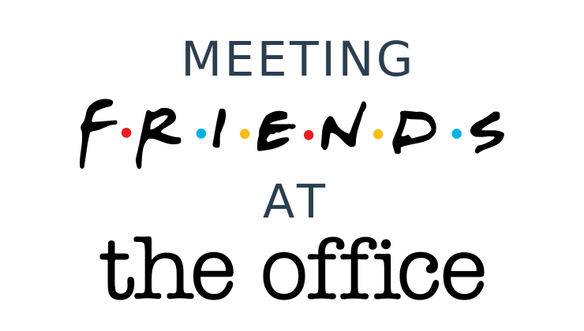

# Welcome to Metting Friends at The Office.

After watching both shows repeatedly, I start to notice that sometimes their
have some similarities. Things like same references, "Joeyincidences" (with a "C"),
actors that appears in both shows, etc. As time goes on, I begin to take notes
and it kept growing and growing ("That's what she said!"), so here's what I found.

### Disclaimer

This book is not about what's the better show, or The Office ripped jokes from
Friends, no. It's just a work from a fan with some spare time to make it.

The seasons are based on Friends, because this show debuted first, September 22, 1994,
and it has dibs. The ideia is to walk you through Friends and point out
similarities with The Office.

# Seasons

- [Season 1](./season-1.md)
- [Season 2](./season-2.md)

# References

- <https://friends.fandom.com/wiki/Friends_Wiki>
- <https://theoffice.fandom.com/wiki/Main_Page>
- <http://officequotes.net/index.php>
