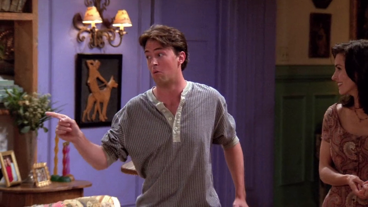

# Season 1

Season 1 of Friends aired from September 22, 1994 to May 18, 1995 on NBC in the US.

## 03 - The One With The Thumb

[Chandler](https://friends.fandom.com/wiki/Chandler_Bing) mentions that
[Alan](https://friends.fandom.com/wiki/Alan), the guy who
[Monica](https://friends.fandom.com/wiki/Monica_Geller-Bing) is seeing, does
a great David Hasselholff impression.

**The Office** [S02E15 - Boys and Girls](https://theoffice.fandom.com/wiki/Boys_and_Girls)

[Lonny](https://theoffice.fandom.com/wiki/Lonny_Collins) insults
[Micheal](https://theoffice.fandom.com/wiki/Michael_Scott) calling him Hasselholff,
because he unbuttom his shirt and shows his hairy chest.

---

[Beth Grant](https://friends.fandom.com/wiki/Beth_Grant)
plays [Lizzy](https://friends.fandom.com/wiki/Lizzy)
in Friends and Dwight's babysitter in The Office
([S04E13 - Dinner Party](https://theoffice.fandom.com/wiki/Dinner_Party)).

---

Chandler has a boxing lizzard puppet at his desk.

**The Office** [S02E09 - Email Surveillance](https://theoffice.fandom.com/wiki/Email_Surveillance)

Micheal has a boxing cat puppet.

## 05 - The One With The East German Laundry Detergent

Ross mentions his Snuggles fabric softner to Chandler before his "date" with Rachel.

**The Office**

Jim, while picking up presents to Kevin with Pam, put fabric softner
in his cart, to Pam's surprise.

---

Rachel left a red sock in an all whites laundry machine and all his clothes
turn to pink.

**The Office**

Pam left a lipstick in her laundry machine and stain a towel.

---

Angela eats his chicken wings like a squirrel.

**The Office** [S06E08 - Koi Pond](https://theoffice.fandom.com/wiki/Koi_Pond)

Angela eats her nuts like a squirrel and Kevin tries to mock her way of eat.

## 06 - The One With The Butt

Joey performs in a musical play called [Freud!](https://friends.fandom.com/wiki/Freud!).

**The Office**

Andy performs in a musical play called "Sweeney Todd".

---

Phoebe read Monica's hand.

**The Office**

Pam read Jim's hand using instructions from a website.

---

With news of a part in a movie, Joey does an impression of Al Pacino lines:
"You are out of order!".

---

**The Office** [S06E10 - Murder](https://theoffice.fandom.com/wiki/Murder)

While stuck in characters of a game, Micheal and Dwight performs
in a similar way.

## 08 - The One Where Nana Dies Twice

Shelly tries to set up Chandler to a man, because she thinks he's gay.
Later he founds out he has a "quality".

> Oh, I thought you guys would be vague about it!

**The Office** [S06E01 - Gossip](https://theoffice.fandom.com/wiki/Gossip)

A rumor is spread in the office about Andy being gay, and he explains
that this was not the first time.

## 11 - The One With Mrs. Bing

To avoid seeing his mother talking about his new book on TV, Chandler
suggest that the gang watches "Weekend at Bernie's".

**The Office** [S03E04 - Grief Counseling](https://theoffice.fandom.com/wiki/Grief_Counseling)

Kevin tells the plot of "Weekend at Bernie's" in a Grief Counseling.

This is recurrent in both shows.

- It's Rachel's favorite movie
    ([S04E12 - The One With The Embryos](https://friends.fandom.com/wiki/The_One_With_The_Embryos)).
- Andy does an impression of Bernie's and mention to Erin, who has never seen the movie
    ([S06E10 - Murder](https://theoffice.fandom.com/wiki/Murder)).
