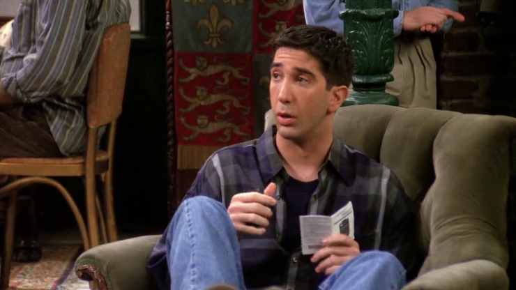
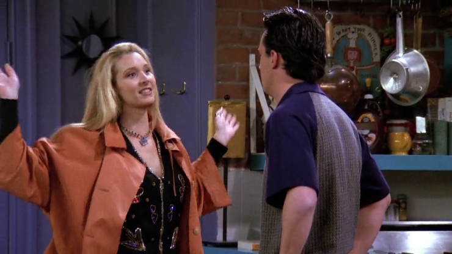

# Season 1

Season 1 of Friends aired from September 22, 1994 to May 18, 1995 on NBC in the US.

## 03 - The One With The Thumb

[Chandler](https://friends.fandom.com/wiki/Chandler_Bing) mentions that
[Alan](https://friends.fandom.com/wiki/Alan), the guy who
[Monica](https://friends.fandom.com/wiki/Monica_Geller-Bing) is seeing, does
a great David Hasselholff impression.

**The Office** [S02E15 - Boys and Girls](https://theoffice.fandom.com/wiki/Boys_and_Girls)

[Lonny](https://theoffice.fandom.com/wiki/Lonny_Collins) insults
[Micheal](https://theoffice.fandom.com/wiki/Michael_Scott) calling him Hasselholff,
because he unbuttom his shirt and shows his hairy chest.

---

[Beth Grant](https://friends.fandom.com/wiki/Beth_Grant)
plays [Lizzy](https://friends.fandom.com/wiki/Lizzy)
in Friends and Dwight's babysitter in The Office
([S04E13 - Dinner Party](https://theoffice.fandom.com/wiki/Dinner_Party)).

---

Chandler has a boxing lizzard puppet at his desk.

**The Office** [S02E09 - Email Surveillance](https://theoffice.fandom.com/wiki/Email_Surveillance)

Micheal has a boxing cat puppet.

## 05 - The One With The East German Laundry Detergent

Ross mentions his Snuggles fabric softner to Chandler before his "date" with Rachel.

**The Office** [S02E19 - Michael's Birthday](https://theoffice.fandom.com/wiki/Michael%27s_Birthday)

Jim, while picking up presents to Kevin with Pam, put fabric softner
in his cart, to Pam's surprise.

---

Rachel left a red sock in an all whites laundry machine and all her clothes
turn to pink.

**The Office** [S05E04 - Baby Shower](https://theoffice.fandom.com/wiki/Baby_Shower)

Pam left a lipstick in her laundry machine and stain a towel.

---

[Angela](https://friends.fandom.com/wiki/Angela_Delveccio) eats her chicken wings like a squirrel.

**The Office** [S06E08 - Koi Pond](https://theoffice.fandom.com/wiki/Koi_Pond)

Angela eats her nuts like a squirrel and Kevin tries to mock her way of eat.

---

Rachel kisses Ross in an uncompromised way.

**The Office** [S02E01 - The Dundies](https://theoffice.fandom.com/wiki/The_Dundies)

Pam kisses Jim at the Dundies in a similar maner.

## 06 - The One With The Butt

Joey performs in a musical play called [Freud!](https://friends.fandom.com/wiki/Freud!).

**The Office** [S07E03 - Andy's Play](https://theoffice.fandom.com/wiki/Andy%27s_Play)

Andy performs in a musical play called "Sweeney Todd".

---

Phoebe read Monica's hand.

**The Office** [S02E06 - The Fight](https://theoffice.fandom.com/wiki/The_Fight)

Pam read Jim's hand using instructions from a website.

---

With news of a part in a movie, Joey does an impression of Al Pacino lines:
"You are out of order!".

---

**The Office** [S06E10 - Murder](https://theoffice.fandom.com/wiki/Murder)

While stuck in characters of a game, Micheal and Dwight performs
in a similar way.

## 08 - The One Where Nana Dies Twice

[Shelly](https://friends.fandom.com/wiki/Shelly) tries to set up Chandler to a man,
because she thinks he's gay. Later Chandler founds out he has a "quality".

> Oh, I thought you guys would be vague about it!

**The Office** [S06E01 - Gossip](https://theoffice.fandom.com/wiki/Gossip)

A rumor is spread in the office about Andy being gay, and he explains
that this was not the first time.

## 11 - The One With Mrs. Bing

To avoid seeing his mother talking about her new book on TV, Chandler
suggest that the gang watches "Weekend at Bernie's".

**The Office** [S03E04 - Grief Counseling](https://theoffice.fandom.com/wiki/Grief_Counseling)

Kevin tells the plot of "Weekend at Bernie's" in a Grief Counseling.

This is recurrent in both shows.

- It's Rachel's favorite movie
    ([S04E12 - The One With The Embryos](https://friends.fandom.com/wiki/The_One_With_The_Embryos)).
- Andy does an impression of Bernie's and mention to Erin, who has never seen the movie
    ([S06E10 - Murder](https://theoffice.fandom.com/wiki/Murder)).

## 15 - The One With The Stoned Guy

Chandler says to Mrs. Tedlock that he has nothing to do with pranks in the office,
although his toys shows the opposite.

**The Office** Throughout the series

Jim is known to constantly prank Dwight.

## 16 - The One With Two Parts, Part 1

Chandler puts a trophy in his desk to impress Nina.

**The Office** [S02E01 - The Dundies](https://theoffice.fandom.com/wiki/The_Dundies)

Micheal hosts the Dundies, where he gives trophies to all his employees,
including himself.

---

Chandler has trouble to fire Nina, and ends up asking her out.

**The Office** [S02E05 - Halloween](https://theoffice.fandom.com/wiki/Halloween)

Micheal has trouble to fire someone from the office. He tries to fire Creed,
and ends up firing [Devon](https://theoffice.fandom.com/wiki/Devon_White).

## 21 - The One With The Fake Monica

In a attempt to put Marcel into a Zoo, Ross mentions it din't get into Scranton Zoo.

**The Office** [S08E15 - Tallahassee](https://theoffice.fandom.com/wiki/Tallahassee)

Daryl mentions a field trip to the zoo (not sure it's the Scranton Zoo),
and hook up with a girl.

**The Office** [S06E26 - Whistleblower](https://theoffice.fandom.com/wiki/Whistleblower)

Michael wants to keep a local newsclip featuring himself as the most viewed
video and enlists the office to watch it 11 times each.
The office instead gets distracted by a video of a baby otter at the Scranton Zoo.

## 22 - "The One With The Ick Factor

To alert about Carol's labor time, Ross got a beeper and the dial number is "55-JIMBO".

**The Office** [S03E17 - Cocktails](https://theoffice.fandom.com/wiki/Cocktails)

Micheal sometimes calls Jim by the nickname "Jimbo".

---

Chandler, that recently became a boss, it's not invited to a party
thrown by his employees. He goes to the party anyway.

**The Office** [S02E09 - Email Surveillance](https://theoffice.fandom.com/wiki/Email_Surveillance)

Jim throws a barbecue and invite everybody except Micheal, who drop by anyway
after his Improv Class.

---

Chandler sings "Ebony and Ivory" on the Karaoke machine with Tracy, one of his employees.

**The Office** [S02E09 - Email Surveillance](https://theoffice.fandom.com/wiki/Email_Surveillance)

Micheal crashes at Jim's BBQ party and tries to sing "Islands in the Stream"
with every female employee on the Karaoke machine, but ends up singing with Jim.

## 23 - The One With The Birth

On their way to the hospital, Susan and Carol stop by the gift shop to by
a stuff animal and a "Chunky" bar.

**The Office** [S03E16 - Business School](https://theoffice.fandom.com/wiki/Business_School)

At the Art Show, Micheal appears at the last minute and confort Pam,
who hugs him and notice something in his pocket. He said it's a "Chunky".
