# Season 10

The tenth season of Friends aired from September 25, 2003 to May 6, 2004.

## 01 - The One After Joey And Rachel Kiss

Precious is dumped by Mike, with Phoebe's help, on her Birthday.

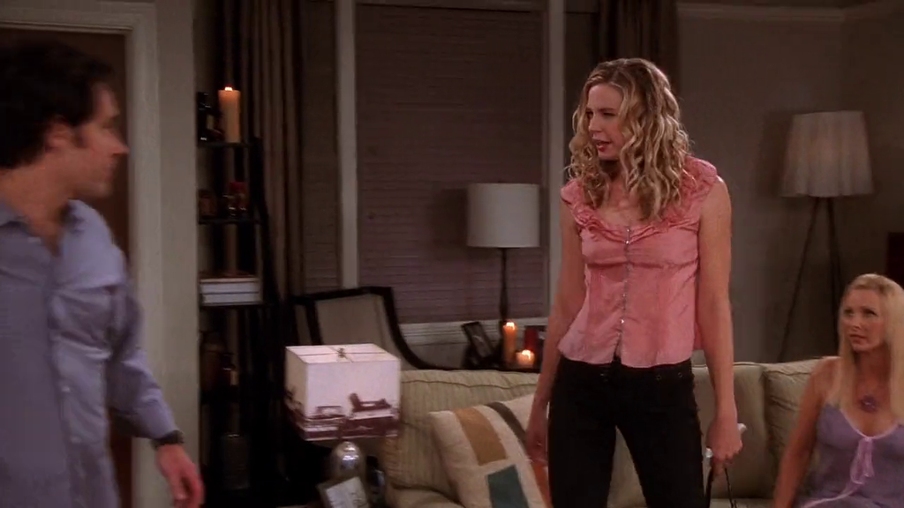

**The Office** [S06E09 - Double Date](https://theoffice.fandom.com/wiki/Double_Date)

Michael dumps Helene, Pam's mom, also on her Birthday.

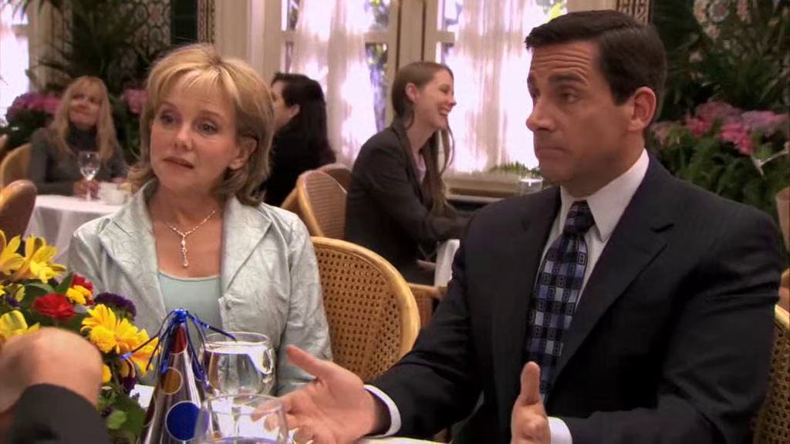

---

Monica got stuck with the cornrows while dancing around and singing "No, woman, no cry"
from Bob Marley.

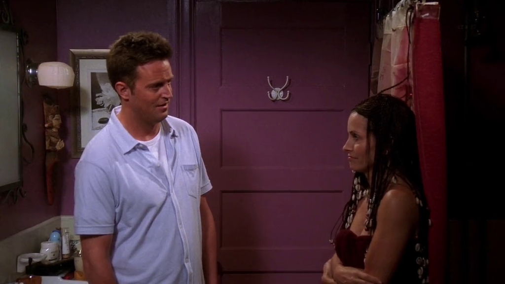

**The Office** [S09E07 - The Whale](https://theoffice.fandom.com/wiki/The_Whale)

The music is also referenced by Erin, while she's sad about Andy sail trip to Bahamas
to sell his family's boat.

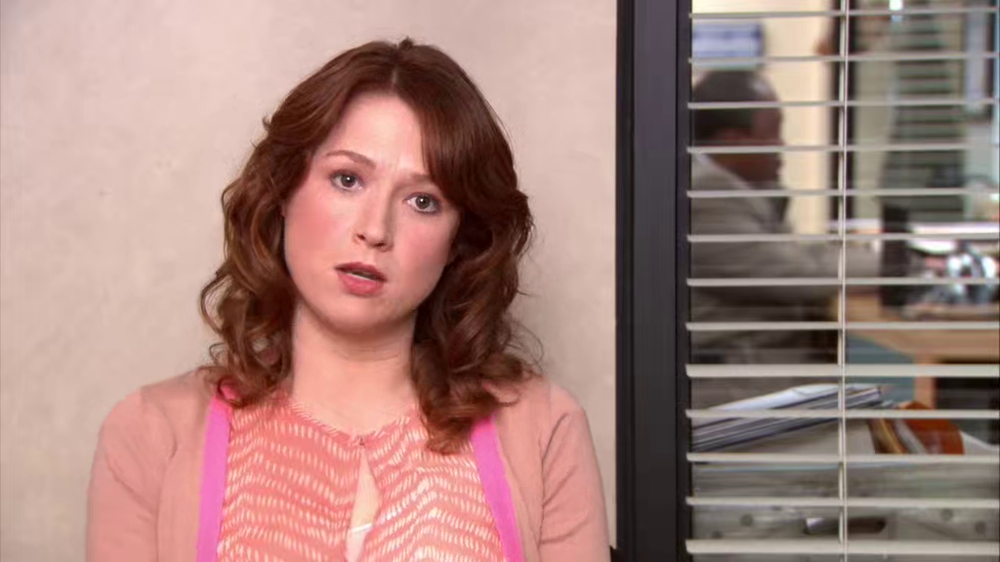

## 09 - The One With The Birth Mother

Ross tries a hat to look good on his date.

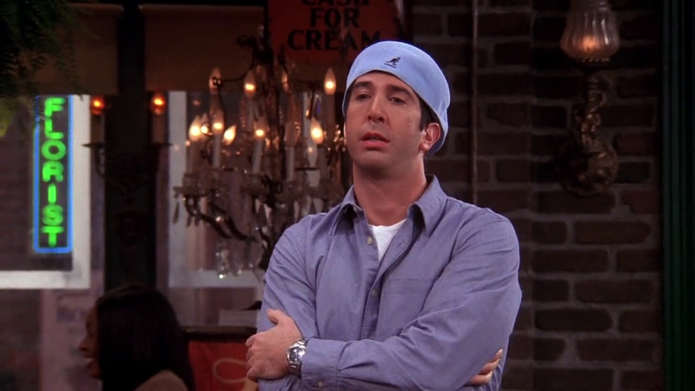

**The Office** [S06E21 - Happy Hour](https://theoffice.fandom.com/wiki/Happy_Hour)

Michael wears a similar hat when he discovers he's on a date with Pam's friend.

> Nice to meet me.

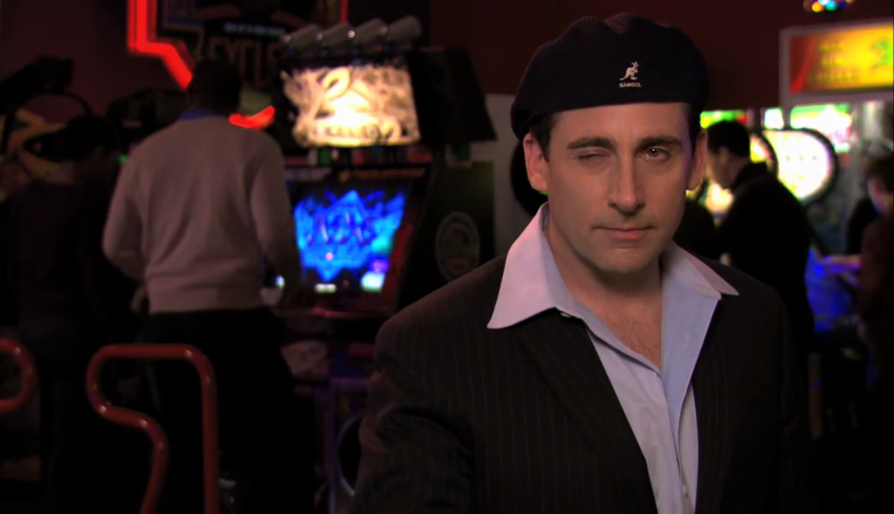

---

Ross ends up wearing the same shirt as his date.

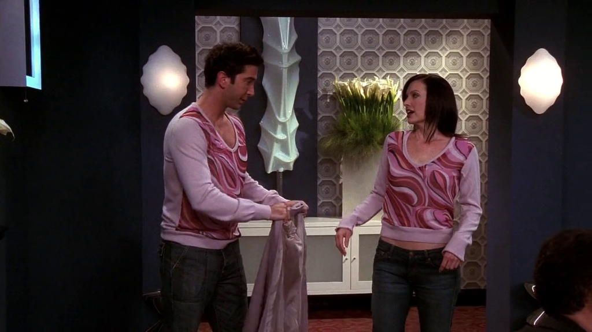

**The Office** [S03E18 - The Negotiation](https://theoffice.fandom.com/wiki/The_Negotiation)

Michael "accidentally cross-dress" on the day that Daryl is asking for a raise.

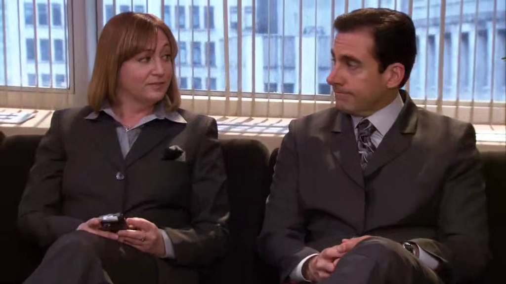

## 11 - The One Where The Stripper Cries

Ross and Chandler asks Missy to checkout their band called Way/No Way. When she
says "No way", they reply "Way!".

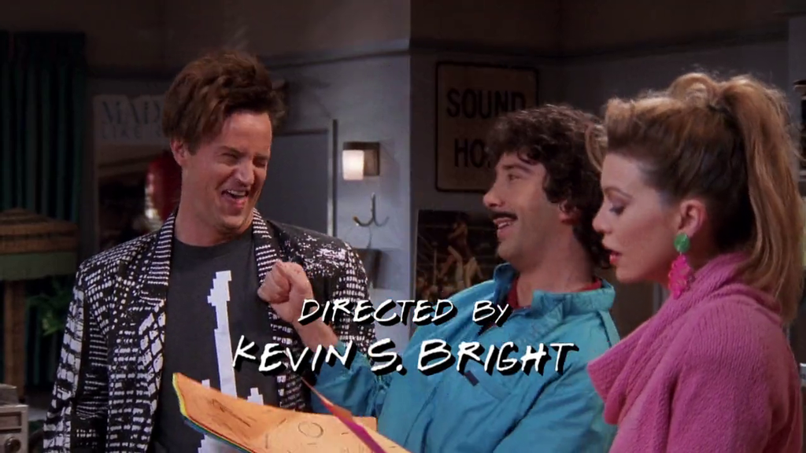

**The Office** [S09E06 - The Boat](https://theoffice.fandom.com/wiki/The_Boat)

At the sail boat, Andy's brother found a guitar and Andy shout:
"No way!", and his brother replies "Way!".

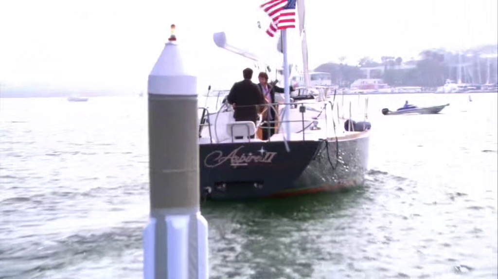

---

After Missy agrees to go see Ross and Chandler's band, Ross says:

> Boss.

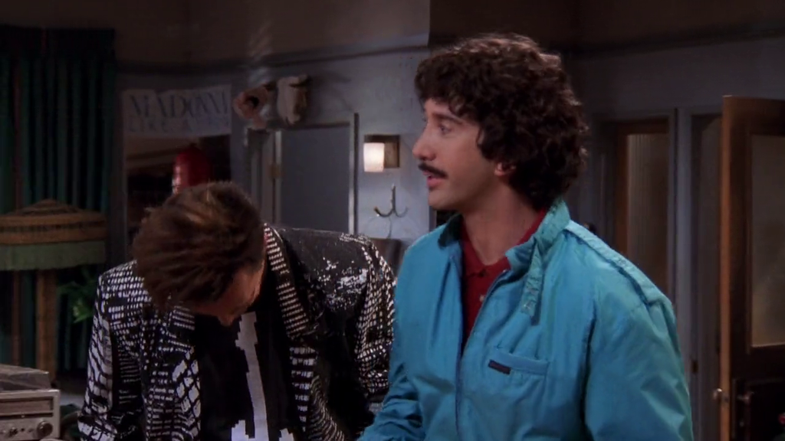

That was **1987**.

**The Office** [S05E14-15 - Stress Relief](https://theoffice.fandom.com/wiki/Stress_Relief)

Michael explains that the expression "Boss" used to mean something cool.

> But now, boss is just slang for jerk in charge.

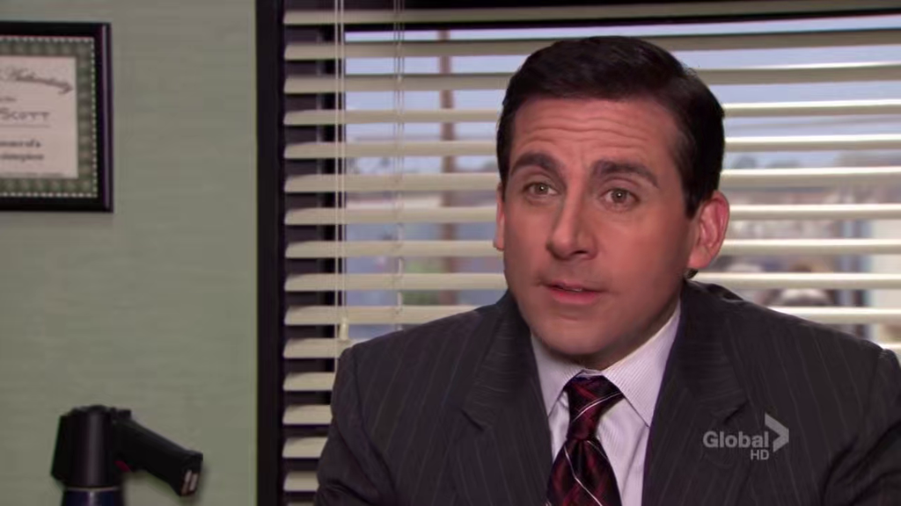

## 12 - The One With Phoebe's Wedding

Phoebe and Mike gets married by the sound of steel drums (also known as conch shell).

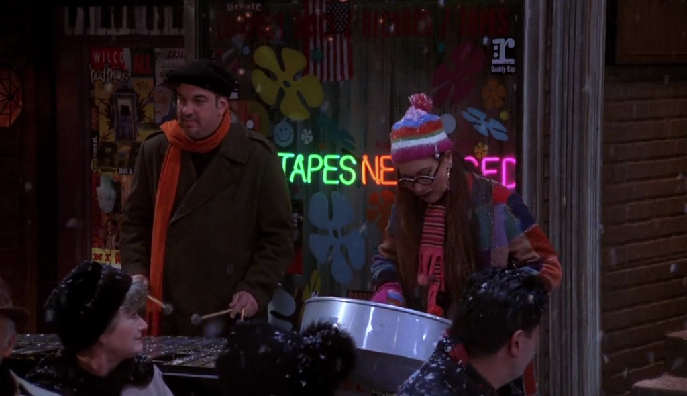

**The Office** [S03E11 - Back From Vacation](https://theoffice.fandom.com/wiki/Back_From_Vacation)

Michael bought steel drums in his vacation to Jamaica.

> Feelin' hot, hot, hot!

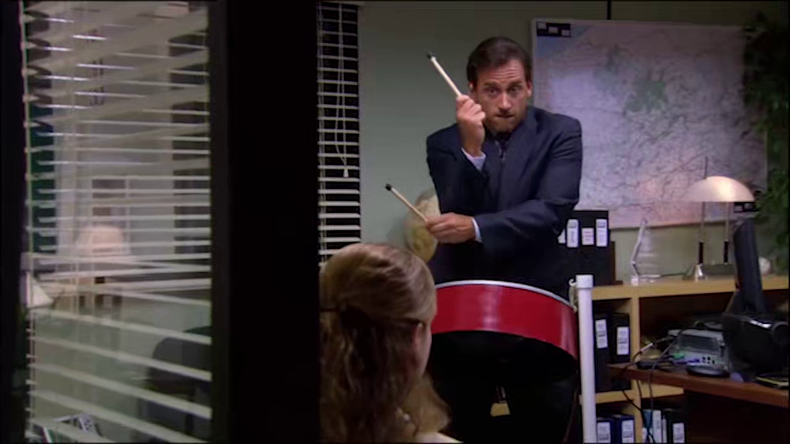

Andy shows his musical talents too.

> Ole ole - ole ole... People in the party - hot hot hot!

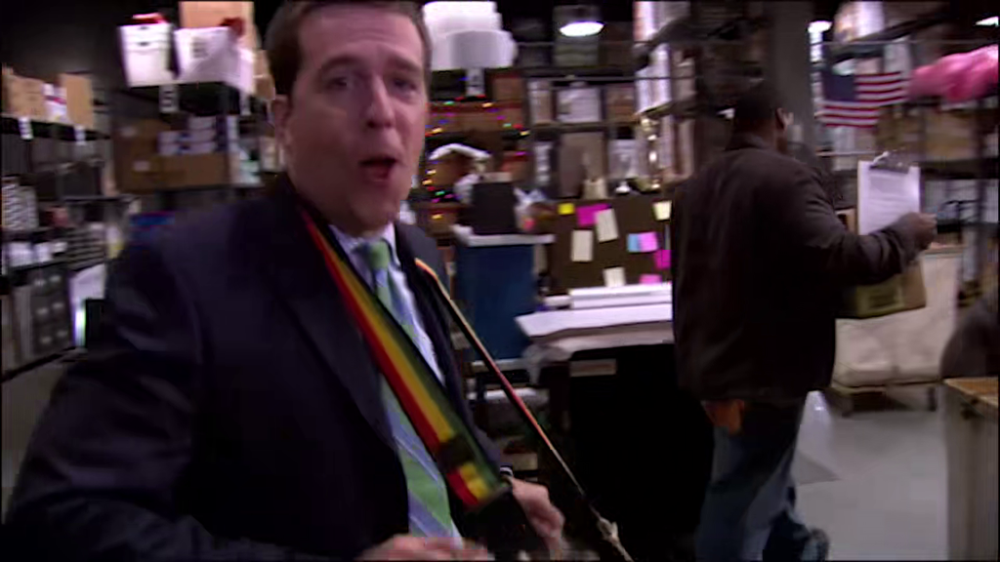

## 14 - The One With Princess Consuela

[Craig Robinson](https://theoffice.fandom.com/wiki/Craig_Robinson)
plays the Clerk on Friends. He plays
[Daryl](https://theoffice.fandom.com/wiki/Darryl_Philbin) on The Office.

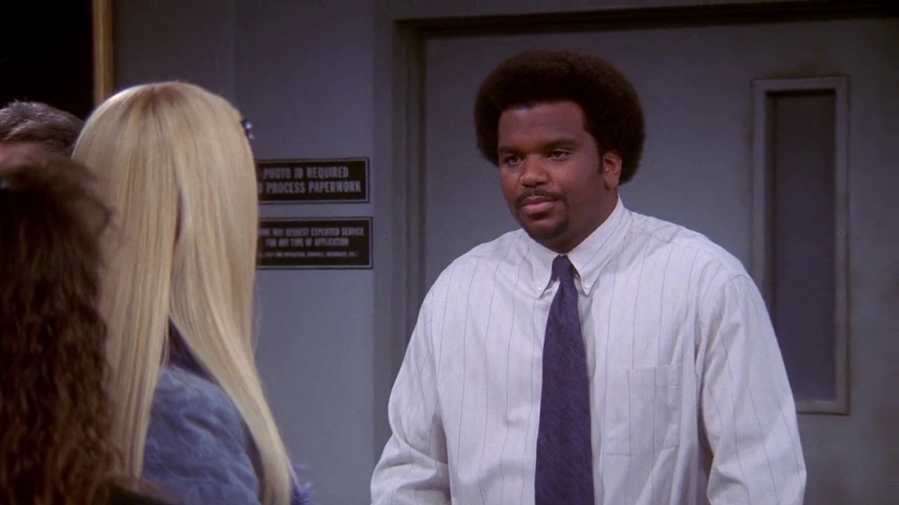

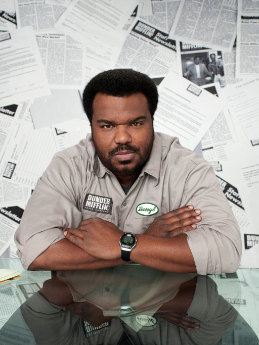
