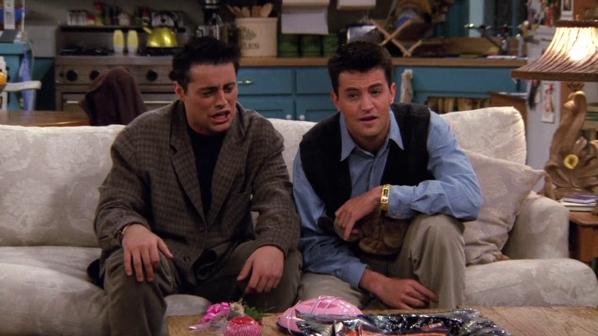
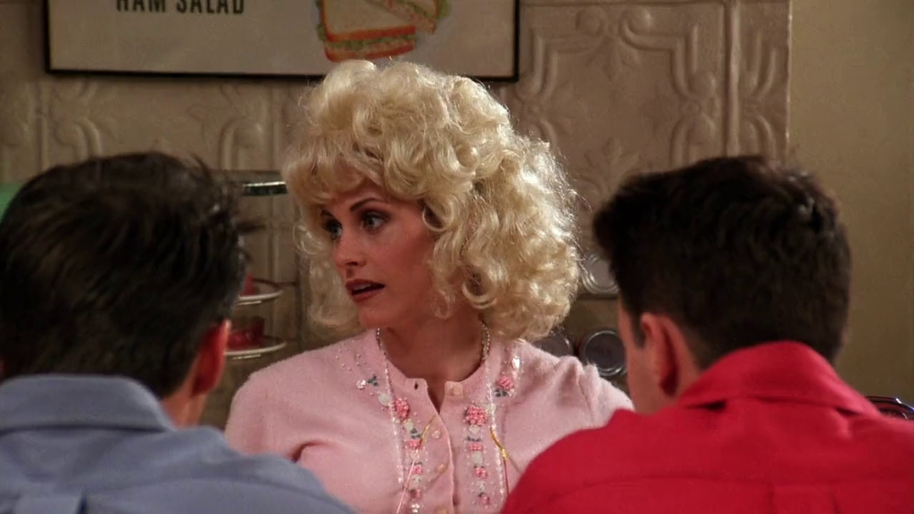
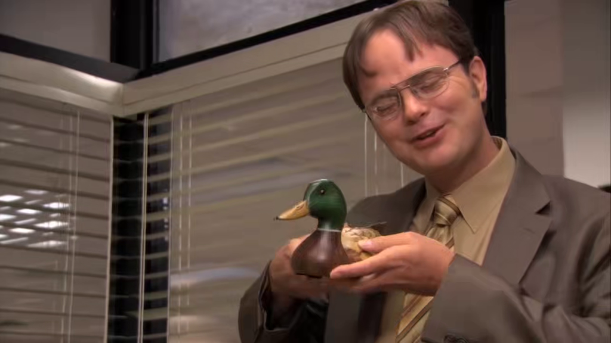

# Season 2

The second season of Friends aired from September 21, 1995 to May 16, 1996.

## 06 - The One With The Baby On The Bus

Stephanie Schiffer, the professional guitar player, plays "Angel of the Morning".

**The Office** [S03E07 - Branch Closing](https://theoffice.fandom.com/wiki/Branch_Closing)

Michael makes a parody of "Angel of the Morning" with Jan's last name:
"Just call me _Levinson_ in the morning, baby".

---

[Hugh Dane](https://friends.fandom.com/wiki/Hugh_Dane)
portrayed a New York Department of Human Services employee on Friends.
On The Office he plays Hank, the "African-American guy" who "...sits behind the desk"
(reference from [S04E11 - Night Out](https://theoffice.fandom.com/wiki/Night_Out)).

> ♫ Me and the blues. It's me and the blues. ♫

Scene from [S05E05 - Crime Aid](https://theoffice.fandom.com/wiki/Crime_Aid).

## 12 - The One After The Superbowl, Part 1

Chandler jokes about leaving "little monkey raisins in the hat"
of his boss, as Marcel used to do it.

**The Office** [S02E14 - The Carpet](https://theoffice.fandom.com/wiki/The_Carpet)

Packer lefts a "package" in the middle of Michael's office, his boss.

---

[Dan Castellaneta](https://friends.fandom.com/wiki/The_Zoo_Employee)
plays a Janitor at the Zoo on Friends and the CEO of Prestige Direct Sale
Solutions on The Office.

Scene from [S08E23 - Turf War](https://theoffice.fandom.com/wiki/Turf_War)

---

The gang visits Marcel in a movie set and sing its favorite song
The Lion Sleeps Tonight, from The Lion King movie.

**The Office** [S03E20 - Product Recall](https://theoffice.fandom.com/wiki/Product_Recall)

To cheer up Andy, Jim sings The Lion Sleeps Tonight and is follow up by Andy.

## 13 - The One After The Superbowl, Part 2

Phoebe succeeds to stop a fight between Rachel and Monica and says:

> If we were in prison, you guys would be like my bitches.

**The Office** [S03E09 - The Convict](https://theoffice.fandom.com/wiki/The_Convict)

Prison Mike explains that in prison you are somebody's bitch.

> Don't drop the soap. Don't drop the soap.

## 14 - The One With The Prom Video

While their watching the video tape where Monica and Rachel goes to their prom,
Ross appears on the screen and Joey says: "Looking good, Mr. Kotter!".

> Looking good Mr. Kotter.

**The Office** [S02E09 - Email Surveillance](https://theoffice.fandom.com/wiki/Email_Surveillance)

To get picked to play in the Improv Class, Michael says:

> Uh, uh! Mr. Kotter... Mr. Kotter.

It's a imitation of the character Horshack from the 1970s television comedy
[Welcome Back, Kotter](https://www.imdb.com/title/tt0072582/).

## 15 - The One Where Ross And Rachel... You Know

Tom Seleck appears in several episodes, starting with this one.
Selleck played the recurring role of Dr. Richard Burke, who
appears in Seasons 2, 3 and 6 of Friends and is referred to often throughout the series.
He is known by his mustache.

**The Office** [S09E07 - The Whale](https://theoffice.fandom.com/wiki/The_Whale)

When Pete appears with a mustache for _Movember_, he says:

> Okay, call down. It’s just me, not Tom Selleck.

## 20 - The One Where Old Yeller Dies

To be more like Richard, Chandler grows a mustache.

**The Office** [S05E01 - Weight Loss](https://theoffice.fandom.com/wiki/Weight_Loss)

Michael grows a goatee after seeing Ryan with one.

## 21 - The One With The Bullies

Monica works at a 50's restaurant, where they play "YMCA" by Village People.

**The Office** [S06E13 - Secret Santa](https://theoffice.fandom.com/wiki/Secret_Santa)

Michael's debit card pin number is "YMCA" or 9622.

## 22 - The One With The Two Parties

Monica always plan parties in committees.

**The Office** Throughout the series

The office has an official
[Party Planning Committee (PPC)](https://theoffice.fandom.com/wiki/Party_Planning_Committee).

---

Chandler and Joey play volleyball.

**The Office** [S06E28 - Company Picnic](https://theoffice.fandom.com/wiki/Company_Picnic)

Team branches play volleyball at a DM convention.

---

Chandler talks about how his parents tried to comfort him by calling
him Chief, Sport, Champ, even Governor ...once.

**The Office** [S04E15 - Night Out](https://theoffice.fandom.com/wiki/Night_Out) and
[S06E26 - Whistleblower](https://theoffice.fandom.com/wiki/Whistleblower)

Jim calls people Chief, Sport or Champ when he doesn't know their names:
Hank and Nick, the IT guy.

## 23 The One With The Chicken Pox

Chandler is eating a muffin and is unable to tell his jokes,
which could be "That's what she said" jokes.

> That'll teach you to lick my muffin.

**The Office** Throughout the series

Michael is known for his "That's what she said" jokes, but his not the
only one who tells as can be seen in [List of the times somebody says "That's what she said"](https://theoffice.fandom.com/wiki/List_of_the_times_somebody_says_%22That%27s_what_she_said%22)

---

Richard has a "Mallard" t-shirt.

**The Office** [S06E07 - The Lover](https://theoffice.fandom.com/wiki/The_Lover)

Dwight gives Jim a wooden Mallard with a "listening device".

---

Chandlers naps at work.

**The Office** [S05E28 - Company Picnic](https://theoffice.fandom.com/wiki/Company_Picnic),
[S06E25 - The Chump](https://theoffice.fandom.com/wiki/The_Chump) and
[S03E03 - The Coup](https://theoffice.fandom.com/wiki/The_Coup)

Michael eats a whole family size chicken pot pie, and then fall asleep.

Jim and Pam also tried to sleep at work.

In a deleted scene, Creed is shown sleeping at work sometimes, **at night time**.

