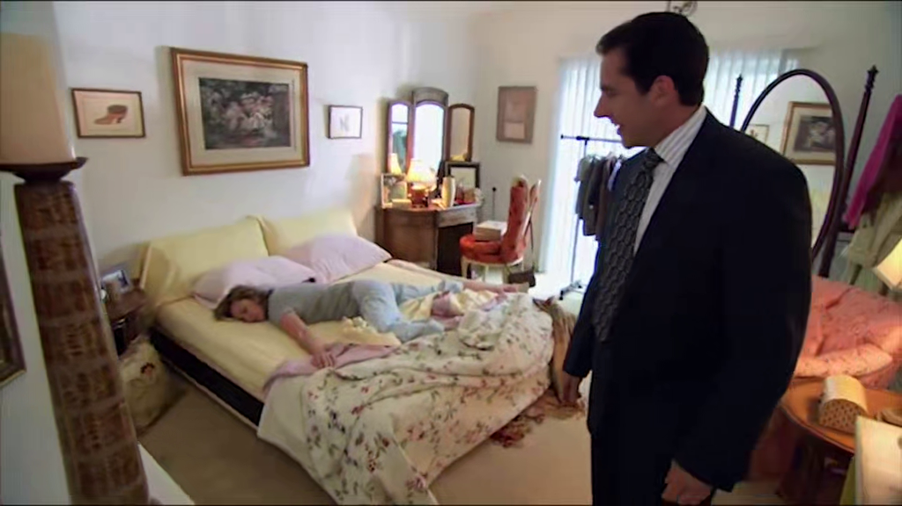
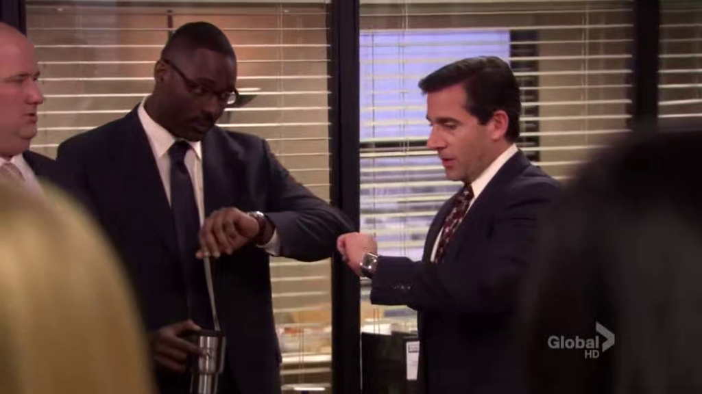

# Season 3

The third season of Friends aired from September 16, 1996 to May 15, 1997.

## 01 - The One With The Princess Leia Fantasy

Rachel wears a Popeye and Olive Oil t-shirt.

**The Office** [S07E06 - Costume Contest](https://theoffice.fandom.com/wiki/Costume_Contest)

Jim and Pam wear a Popeye and Olive Oil costume for Halloween.

> My hero!

## 03 - The One With The Jam

Phoebe calls his stalker J-crew guy.

**The Office** [S06E01 - Gossip](https://theoffice.fandom.com/wiki/Gossip)

Michael spreads a gossip that one of his employees is a J-crew model.

---

Monica suddenly has the idea of having a baby after his "jam plan".

**The Office** [S03E02 - The Convention](https://theoffice.fandom.com/wiki/The_Convention)

Michael, inspired by Angelina Jolie, questions Pam about adopting a baby.

---

Chandler and Ross talk about space issues at sleeping time.

> Freedom! Except for this arm.

**The Office** [S04E01 - Fun Run](https://theoffice.fandom.com/wiki/Fun_Run)
and [S04E13 - Dinner Party](https://theoffice.fandom.com/wiki/Dinner_Party)

Jan has space issues, and makes Michael sleeps on a pretty narrow side bed.

> Jan has some space issues, so I curl up on that puppy.

## 05 - The One With Frank Jr.

Monica tells Phoebe about how she and Ross played the shadow game when they were kids.

**The Office** [S05E20 - New Boss](https://theoffice.fandom.com/wiki/New_Boss)

Michael, in his anger, do the shadow game with Charles Miner, his new boss.

## 07 - The One With The Race Car Bed

[Gunther](https://friends.fandom.com/wiki/Gunther) shows that he has a crush on Rachel.

**The Office** [S03E02 - The Convention](https://theoffice.fandom.com/wiki/The_Convention)
and developed throughout the series

[Toby](https://theoffice.fandom.com/wiki/Toby_Flenderson) has a crush on Pam.

## 12 - The One With All The Jealousy

Joey is supposed to perform a dance in a play that ends with Jazz Hands.

**The Office** [S07E24 - Dwight K. Schrute, (Acting) Manager](https://theoffice.fandom.com/wiki/Dwight_K._Schrute%2C_(Acting)_Manager)

Jim blackmails Dwight to do Jazz hands to Jo every time he coughs.

---

Every time his in a difficult situation, Joey runs.

**The Office** [S04E18-19 - Goodbye, Toby](https://theoffice.fandom.com/wiki/Goodbye,_Toby)
and [S08E24 - Free Family Portrait Studio](https://theoffice.fandom.com/wiki/Free_Family_Portrait_Studio)

Every time his in a difficult situation,
[Mose](https://theoffice.fandom.com/wiki/Mose_Schrute) runs.

## 20 - The One With The Dollhouse

Joana treats Sophie poorly.

**The Office** Throughout the series

Michael treats Toby even more poorly.

> NOOOO! GOD! No, God, please no! No! No! NOOO!

Classic scene from [S05E09 - Frame Toby](https://theoffice.fandom.com/wiki/Frame_Toby).
