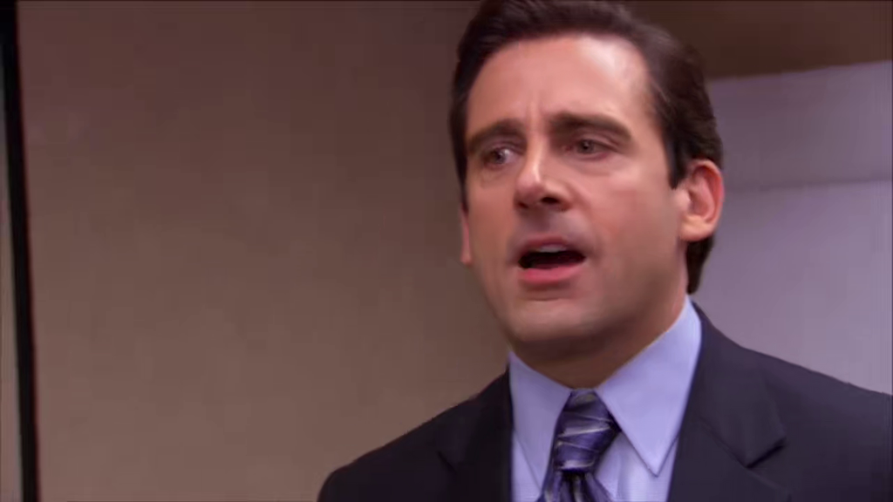
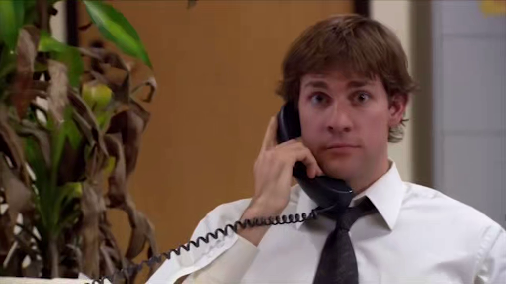

# Season 4

The fourth season of Friends aired from September 25, 1997 and ended on May 7, 1998.

## 01 - The One With The Jellyfish

Monica gets stung by a jellyfish, and Joey suggest that she needs to pee on the wound.

**The Office** [S07E01 - Nepotism](https://theoffice.fandom.com/wiki/Nepotism)

Michael talks about his summer, and says that he stepped on a piece of glass in
the parking lot and the fact that it got infected, even though he peed on it.

## 05 - The One With Joey's New Girlfriend

Ross brags about his new girlfriend, Amanda, to make Rachel jealous but Chandler
previously reveals to her that he just goes out with her to Chuck E. Cheese.

**The Office** [S02E12 - The Injury](https://theoffice.fandom.com/wiki/The_Injury)

When Dwight have a concussion, Jim drives him to the hospital with Michael but
when Dwight asks where they are going, Jim replies that they're going to Chuck E. Cheese.
Michael says:

> I'm so sick of Chuck E. Cheese.

---

Kathy wears a blue Varsity t-shirt.

**The Office** [S03E03 - The Coup](https://theoffice.fandom.com/wiki/The_Coup)

Michael makes the office watches Varsity Blues every Monday.

## 06 - The One With The Dirty Girl

Joey shops for Kathy's birthday at Officemax.

**The Office** [S03E16 - Business School](https://theoffice.fandom.com/wiki/Business_School)

Officemax is a competitor to Dundler Mifflin.

---

Friends: Phoebe claims she's a hard ass after successfully catering a funeral
with Monica.

**The Office** [S08E10 - Christmas Wishes](https://theoffice.fandom.com/wiki/Christmas_Wishes)

Andy wears a "Hard Ass" hat.

## 09 - The One Where They're Going To Party

Chandler asks Ross: "Are you ready to party?" twice, with a squeaky
voice at the second time.

**The Office** [S03E06 - Diwali](https://theoffice.fandom.com/wiki/Diwali)

Andy asks Jim "Are you ready to party?" in a similar tone.

## 10 - The One With The Girl From Poughkeepsie

Chandler tells Monica a story of a Director, Orlson Wells, that hires
someone just to be fired in front of everyone, to shows who's boss.

**The Office** [S03E08 - The Merger](https://theoffice.fandom.com/wiki/The_Merger)

Dwight suggests to Michael to fire [Tony](https://theoffice.fandom.com/wiki/Tony_Gardner)
on his first day at Dundler Mifflin Scranton branch.

> ...to consolidate power.

## 16 - The One With The Fake Party

Rachel, to impress Joshua, tries to tie a cherry to a not just using her
tongue and chokes on it.

**The Office** [S06E21 - Happy Hour](https://theoffice.fandom.com/wiki/Happy_Hour)

"Date Mike" tries to do the same to impress his date, and chokes on it, too.

## 17 - The One With The Free Porn

Rachel hums a music and Chandler remembers her that it comes from
a porn movie.

**The Office** [S03E14 - Ben Franklin](https://theoffice.fandom.com/wiki/Ben_Franklin)
and [S04E17 - Job Fair](https://theoffice.fandom.com/wiki/Job_Fair)

Michael introduces Mr. "Ben Franklin" and state that he's sexy. Then, sings _bow chicka bow_,
mimicking the style of music associated with pornographic films.

> Bow chicka bow.

After Jim closes a sale, he greets Pam at the office and kisses her
in front of Andy and Kevin, which sings a similar song.

---

After saying to Emily that he loves her and she doesn't say it back, Ross
got so angry that he tried put his fist through a wall, but miss and hit the door.

**The Office** [S03E13 - The Return](https://theoffice.fandom.com/wiki/The_Return)

After Jim and Pam prank him by hiding his phone, Andy puts his fist through a wall.

## 20 - The One With All The Wedding Dresses

To cheer up, Rachel wears a wedding dress. But Joshua drops by, sees her, freaks out
and left.

> I do...

**The Office** [S03E02 - The Convention](https://theoffice.fandom.com/wiki/The_Convention)

Michael suggests to Pam to wear her wedding dress on her date, saying that it's
going to be hilarious.

## 21 - The One With The Invitation

Joey and Chandler are talking about renting Die Hard, which is their favorite movie.

**The Office** [S09E09 - Dwight Christmas](https://theoffice.fandom.com/wiki/Dwight_Christmas)

Pete tells Erin that he had memorized every line of Die Hard.

This is recurrent in both shows:

- Ross, Joey and Chandler watch Die Hard at Ross' place ([S07E06 - The One With The Nap Partners](https://friends.fandom.com/wiki/The_One_With_The_Nap_Partners)).

- Michael compares Die Hard and Die Hard 4 with his coworkers at his Marketing job ([S04E07-08 - Money](https://theoffice.fandom.com/wiki/Money)).

- Michael calls Oscar "faggie" for liking the movie Shakespeare in Love more than Die Hard ([S03E01 - Gay Witch Hunt](https://theoffice.fandom.com/wiki/Gay_Witch_Hunt)).

- It appears on one verse of the goodbye music to Michael.

> Nine million, nine hundred eighty six thousand minutes!
> That's like watching Die Hard, eighty thousand times!

## 24 - The One With Ross' Wedding, Part 2

[Felicity](https://friends.fandom.com/wiki/Felicity) asks Joey to talk New York to her
and he replies:

> Forget about it.

**The Office** [S02E16 - Valentine's Day](https://theoffice.fandom.com/wiki/Valentine%27s_Day)

Michael, on his way to New York to meet the new CFO (not his initials, common mistake), says to the office:

> _Fuggedaboutit_.

_Fuggedaboutit_ is the phrase "Forget about it" in an exaggerated Italian New York accent.
