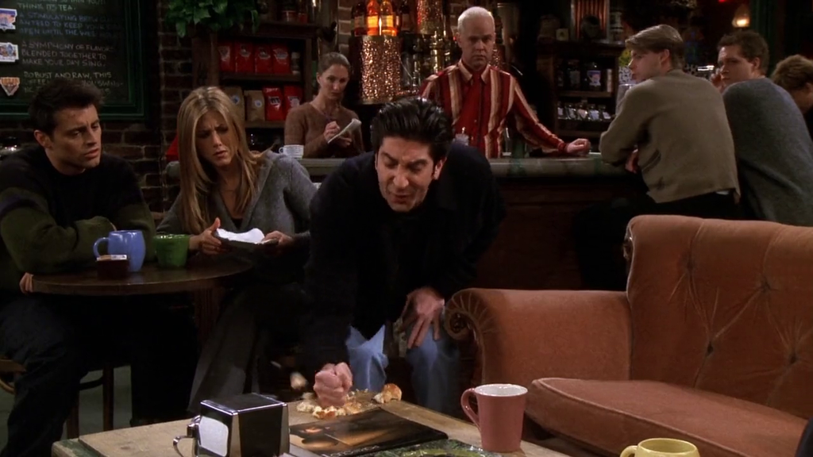
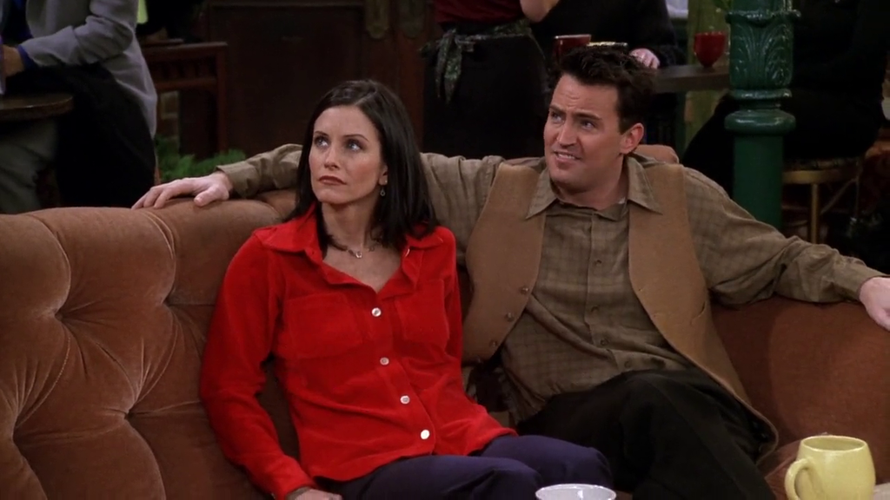
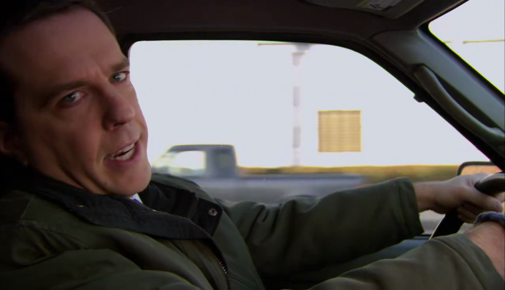
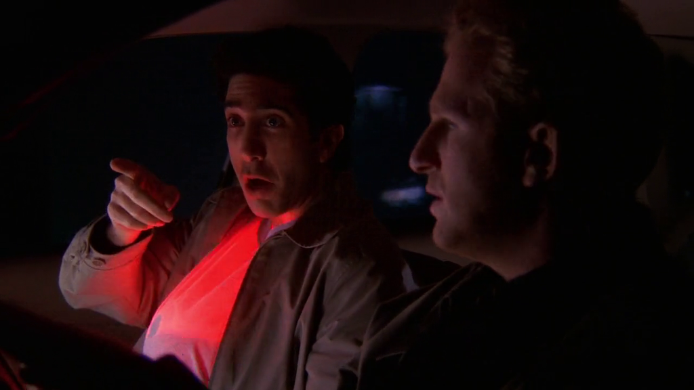
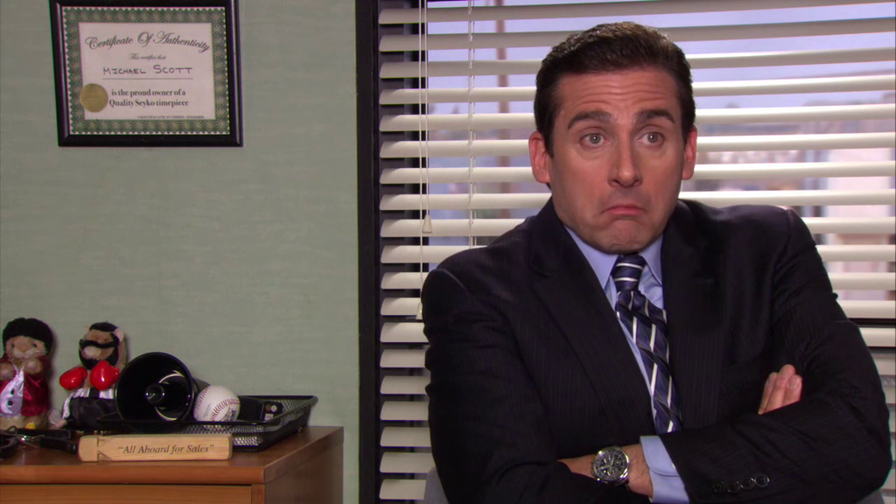
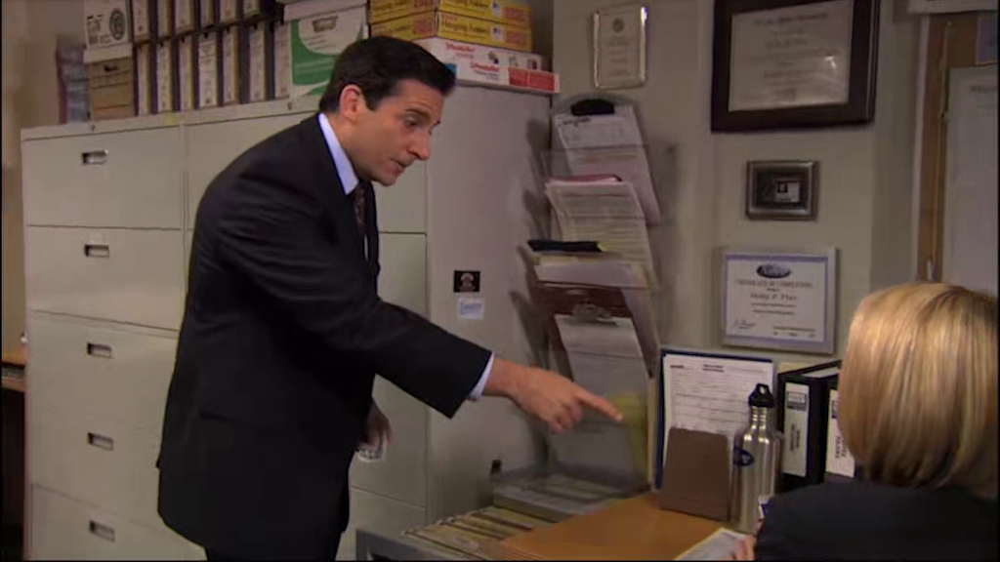

# Season 5

The fifth season of Friends aired from September 24, 1998 to May 20, 1999.

## 12 - The One With Chandler's Work Laugh

Ross discover that Emily is getting married and "punch" an English scone.
Chandler asks if is that is what Ross learned at the anger management class.

**The Office** [S03E14 - The Return](https://theoffice.fandom.com/wiki/The_Return)

Jim and Pam pranked Andy and he freak out and punch a wall. After
that he goes to an anger management class.

## 20 - The One With The Ride-Along

At the ride along with Gary, Ross does an impression of E.T.

> Phone home.

**The Office** [S04E18-19 - Goodbye, Toby](https://theoffice.fandom.com/wiki/Goodbye,_Toby)
and [S07E13 - The Ultimatum](https://theoffice.fandom.com/wiki/The_Ultimatum)

Michael mentions the movie [E.T. the Extra-Terrestrial](https://www.imdb.com/title/tt0083866/?ref_=nv_sr_1).

> Like E.T. Is Holly our extraterrestrial? Maybe.

Michael and Holly talk like E.T.

> E.T. phone Holly. Holly like phone?

