# Season 6

The sixth season of Friends aired from September 23, 1999 to May 18, 2000.

## 07 - The One Where Phoebe Runs

Rachel complains about the way Phoebe runs, and says that she looks like
a cross between Kermit the frog and the Six Million Dollar Man.

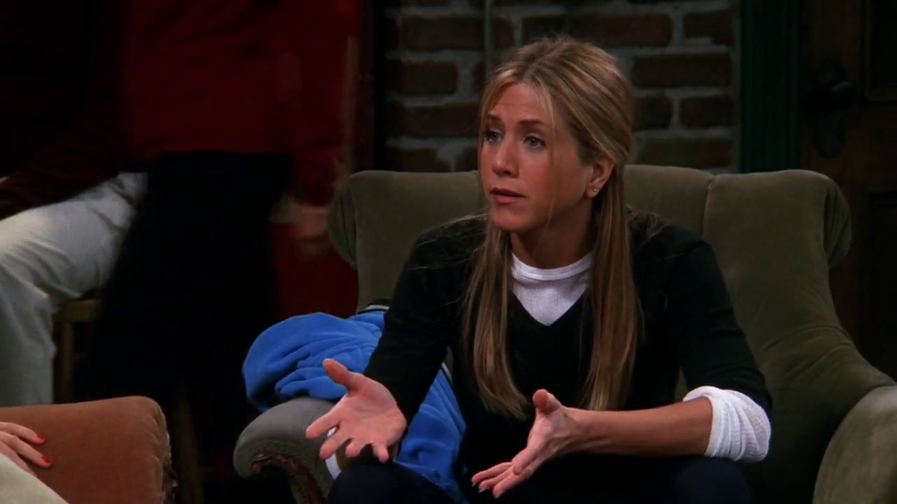

> Come on, that's not running. Let's go!

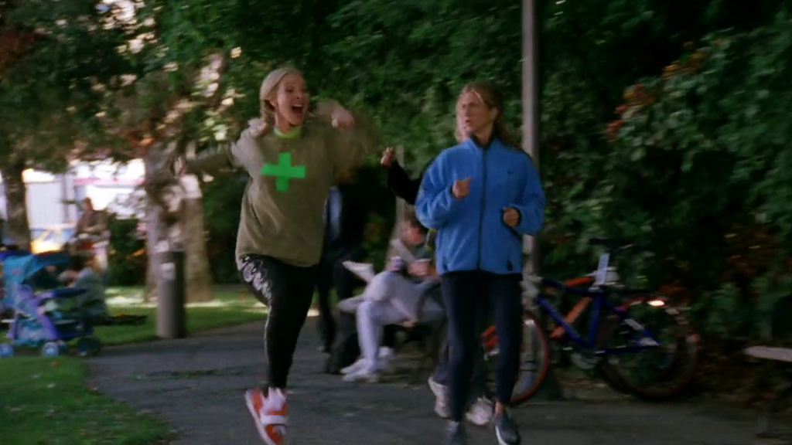

**The Office** [S01E01 - Pilot](https://theoffice.fandom.com/wiki/Pilot)

Michael does an impersonation of the Six Million Dollar Man to Pam.

> Sha-ta-ta-ta-ta-ta-ta-ta...

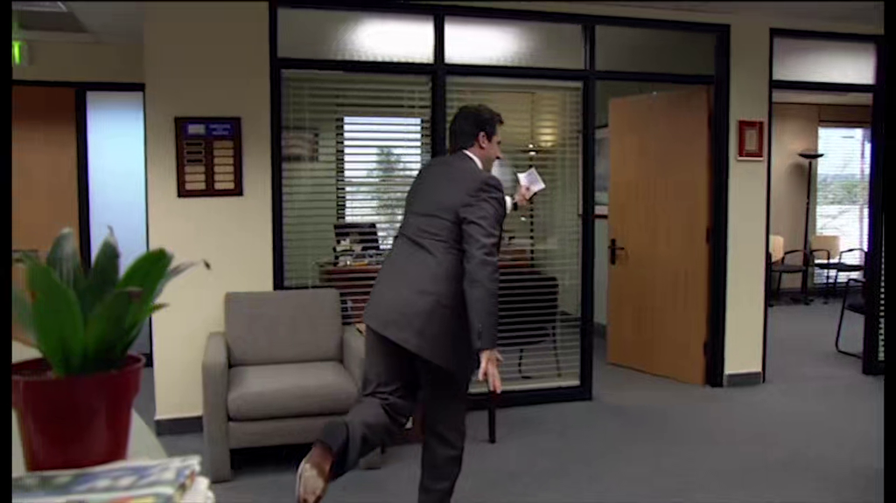

The Six Million Dollar Man was a television program popular in the 1970s.
The title character was a cyborg, and footage of the character performing
superhuman feats were played in slow motion and accompanied by a sound effect
similar to the one Michael makes.

## 15 - The One That Could Have Been, Part 1

Ross wonders if he'd still be doing karate if he and Carol were still married.

**The Office** [S02E06 - The Fight](https://theoffice.fandom.com/wiki/The_Fight)

Dwight is Senpai, which is Assistant "to the" Sensei, and practices Goju-Ryu karate.

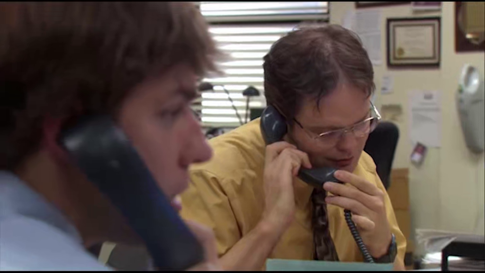

## 21 - The One Where Ross Meets Elizabeth's Dad

After meeting Wayne, Joey mentions that he thought that C.H.E.E.S.E. was gonna
be a really cool robot, like the Terminator.

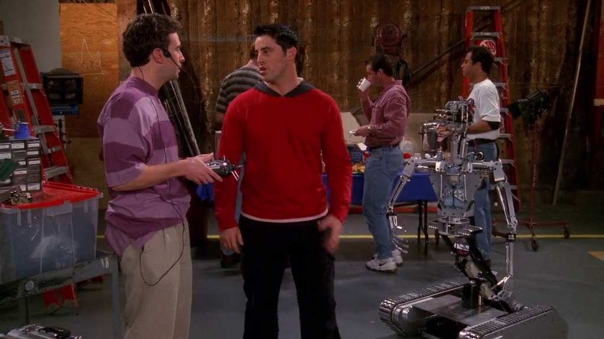

**The Office** [S02E03 - Office Olympics](https://theoffice.fandom.com/wiki/Office_Olympics),
[S03E05 - Initiation](https://theoffice.fandom.com/wiki/Initiation)
and [S03E23 - The Job](https://theoffice.fandom.com/wiki/The_Job)

The movie [Terminator](https://www.imdb.com/title/tt0088247/?ref_=nv_sr_3) is mentioned several times.

> Check it out. Terminator.

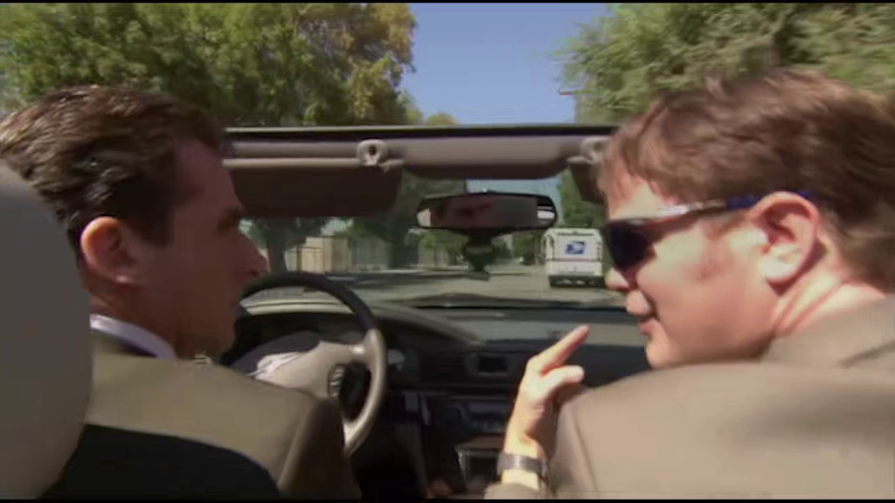

> I'll be back.

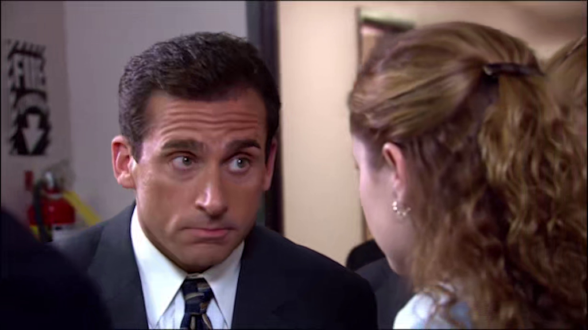

> I'll be baaaaack! And I am baaaack!

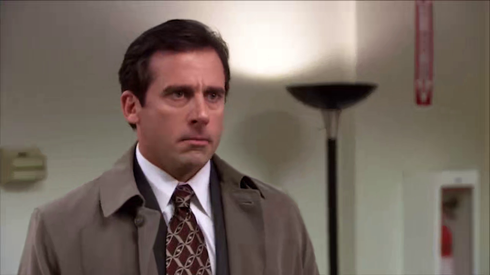

---

In opposition to Phoebe's books characters Marsha and Chester, Monica
creates Phyllis.

> Phyllis knows what I'm doing...

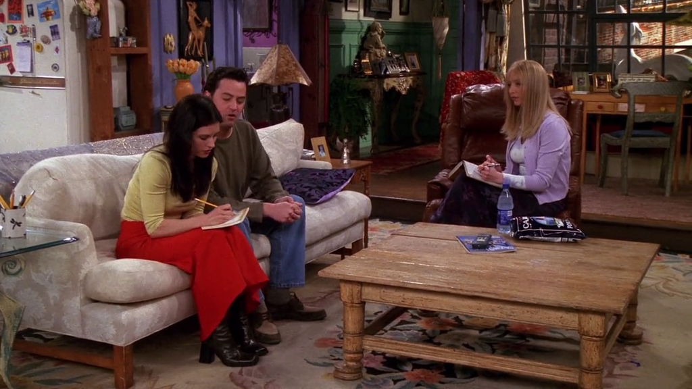

**The Office**

One of the office's employees is [Phyllis](https://theoffice.fandom.com/wiki/Phyllis_Vance)
played by [Phyllis Smith](https://theoffice.fandom.com/wiki/Phyllis_Smith).

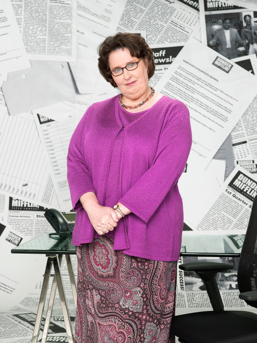

## 24 - The One With The Proposal, Part 1

Joey doesn't know how a silent auction works and buys a boat.

> I won!

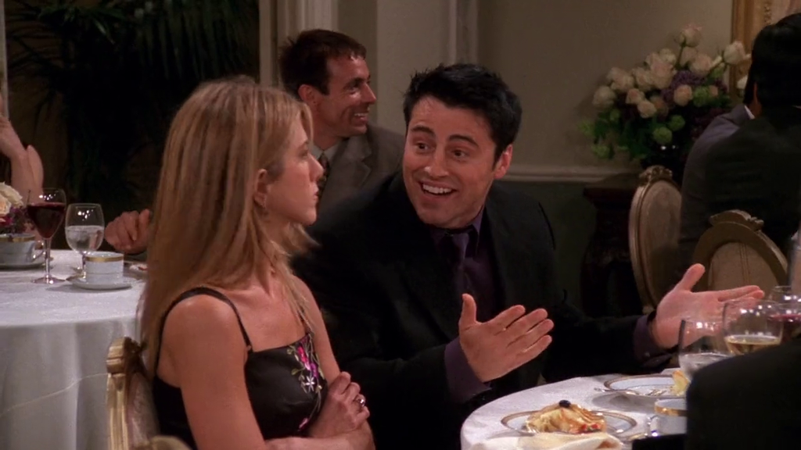

**The Office** [S08E22 - Fundraiser](https://theoffice.fandom.com/wiki/Fundraiser)

Dwight confuses a silent auction with a "Guess the Price" and buys every
item searching for the real value on-line.

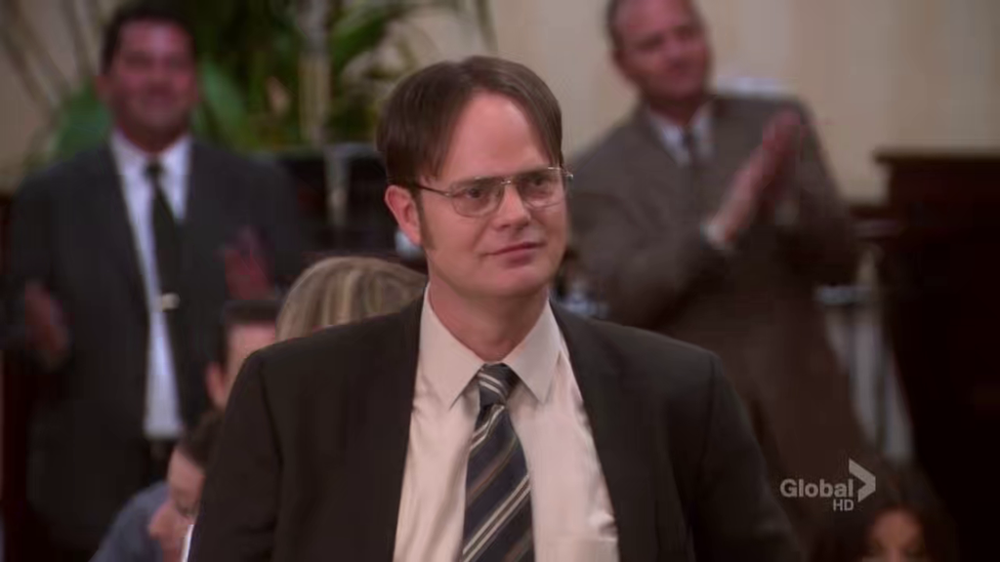

---

Mr. Bowmount wife's name is Pam.

> You've got the wind in your ha...arms.

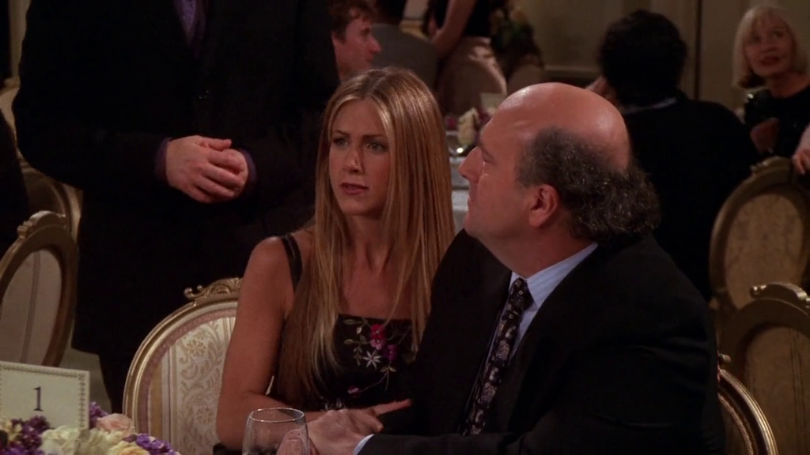

**The Office**

One of the office's employees is [Pam](https://theoffice.fandom.com/wiki/Pam_Halpert)
played by [Jenna Fischer](https://theoffice.fandom.com/wiki/Jenna_Fischer).

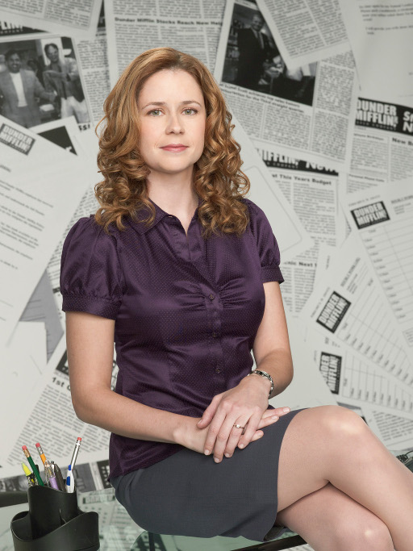
