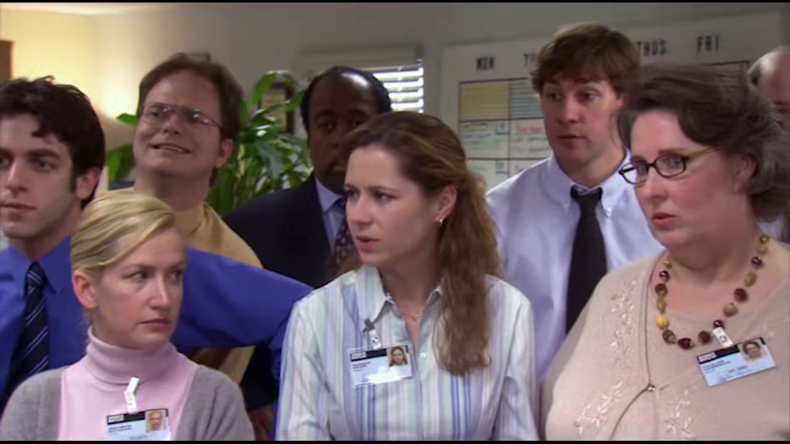
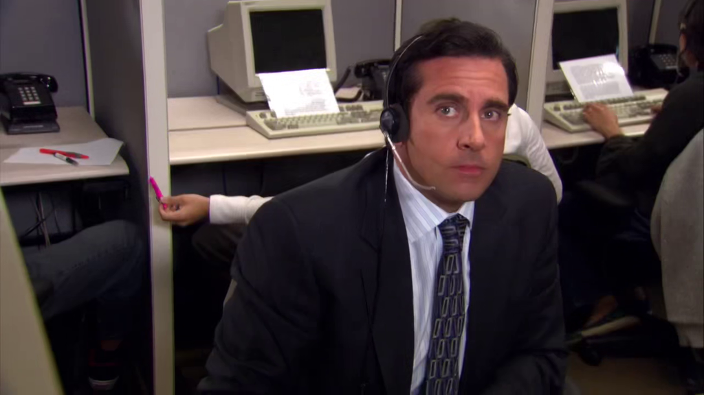
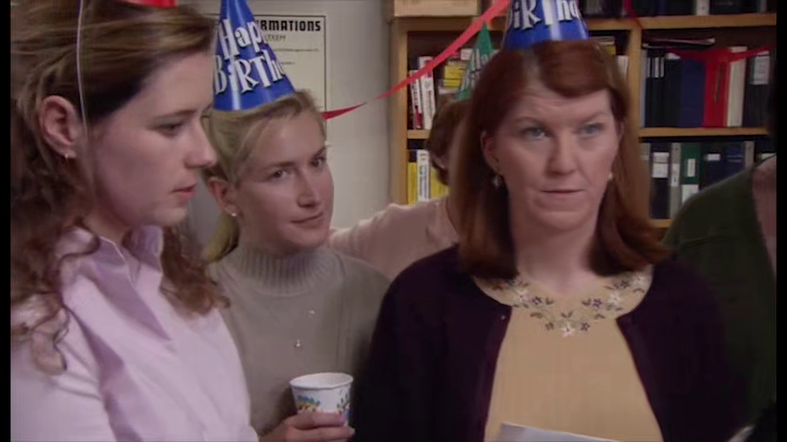
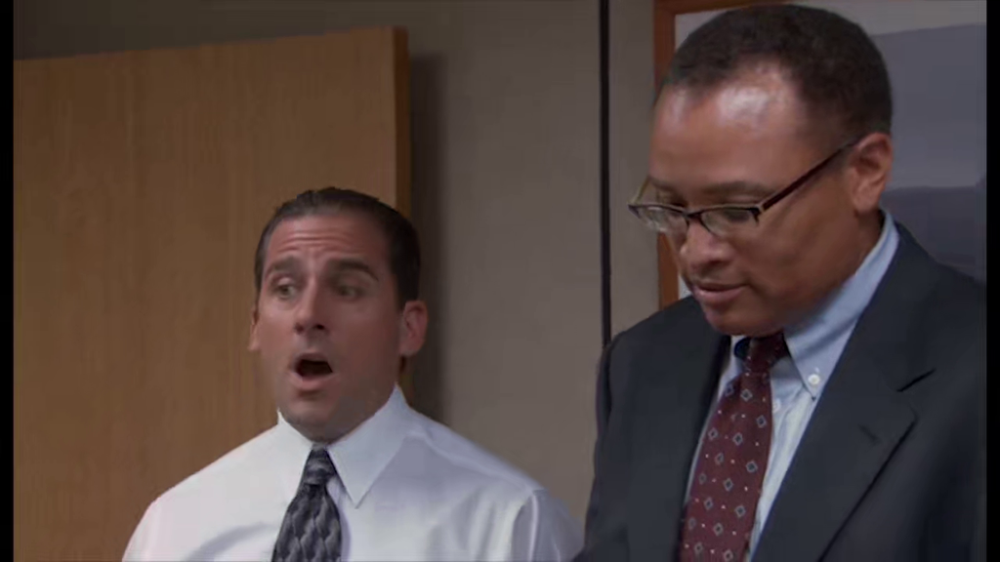

# Season 7

The seventh season of Friends aired from October 12, 2000 to May 17, 2001.

## 05 - The One With The Engagement Picture

Chandler struggles to smile to take a picture.

> I'm not going. "I'm going"...

**The Office** [S02E21 - Conflict Resolution](https://theoffice.fandom.com/wiki/Conflict_Resolution)

Dwight states that he never smile if he can. However, at the last
group picture you can see him struggling to smile, briefly.

## 06 - The One With The Nap Partners

Ross, Joey and Chandler are big fans of Die Hard.

[Checkout the other references here.](./season-4.md#_21-the-one-with-the-invitation)

## 13 - The One Where Rosita Dies

Phoebe takes a side job at telemarketing while his regular massage job is down.

**The Office** [S04E07-08 - Money](https://theoffice.fandom.com/wiki/Money)

Michael takes a side job at telemarketing to support Jan's expenses.

## 14 - The One Where They All Turn Thirty

Chandler gives Rachel a birthday card with a joke about being old.

**The Office** [S01E04 - The Alliance](https://theoffice.fandom.com/wiki/The_Alliance)

Michael writes not so good jokes in Meredith's birthday card also about being old.

>  "Meredith, let's hope the only downsizing that happens to you is that
> someone downsizes your age."

## 15 - The One With Joey's New Brain

Ross plays Celebration, by Kool & the Gang with his bagpipe.

**The Office** [S01E02 - Diversity Day](https://theoffice.fandom.com/wiki/Diversity_Day)

Michael says the lyrics of the song while Mr. Brown is talking
about diversity at the conference room.

> Celebrate good times. Come on! Let's celebrate diversity. Right?

## 18 - The One With Joey's Award

At the end of the episode Phoebe chants:

> Live from New York, it's Saturday Night!

**The Office**

The office quotes many episodes from Saturday Night Live (SNL). It's Michael's favorite show.

[List of Recurring Cultural References of SNL](https://theoffice.fandom.com/wiki/List_of_Recurring_Cultural_References#Saturday_Night_Live)

<a href="https://vimeo.com/169329131">Rainn Wilson Hosts SNL: The Office Parody</a> from <a href="https://vimeo.com/cheesypita">CheesyPita</a> on <a href="https://vimeo.com">Vimeo</a>.

<iframe src="https://player.vimeo.com/video/169329131" width="640" height="360" frameborder="0" webkitallowfullscreen mozallowfullscreen allowfullscreen></iframe>

<a href="https://vimeo.com/256498887">SNL Digital Short_ Lazy Sunday</a> from <a href="https://vimeo.com/user81459880">John</a> on <a href="https://vimeo.com">Vimeo</a>.

<iframe src="https://player.vimeo.com/video/256498887" width="640" height="360" frameborder="0" webkitallowfullscreen mozallowfullscreen allowfullscreen></iframe>

<a href="https://youtu.be/YU2l6ZX-e4I">Michael PREMIERES Lazy Scranton</a> from <a href="https://www.youtube.com/channel/UCa90xqK2odw1KV5wHU9WRhg">The Office US</a> on <a href="https://www.youtube.com">YouTube</a>.

<iframe width="640" height="360" src="https://www.youtube.com/embed/YU2l6ZX-e4I" frameborder="0" allow="accelerometer; autoplay; encrypted-media; gyroscope; picture-in-picture" allowfullscreen></iframe>
