# Season 8

The eighth season of Friends aired from September 27, 2001 to May 16, 2002.

## 02 - The One With The Red Sweater

Phoebe states to Rachel that she is more than a pretty blond with an ass that won't quit.

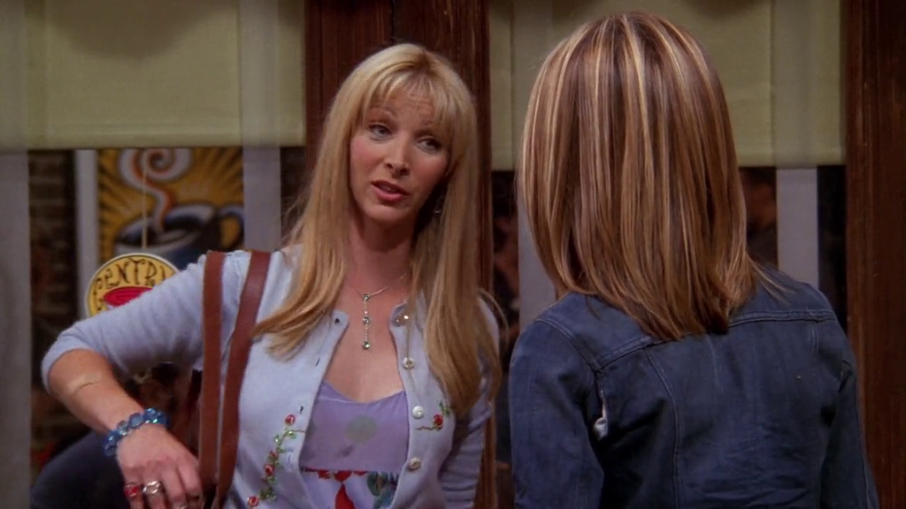

**The Office** [S05E01-02 - Weight Loss](https://theoffice.fandom.com/wiki/Weight_Loss)

Holly has the same features, according to Michael.

> And that her butt refuses to quit!

## 08 - The One With The Stripper

[Jackie Debatin](https://theoffice.fandom.com/wiki/Jackie_Debatin)
features as a stripper/hooker in both shows, with the same name, Elisabeth.

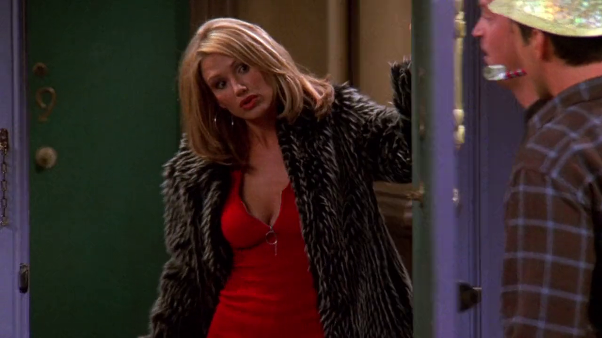

**The Office**

She make several appearances on The Office.

[S03E14 - Ben Franklin](https://theoffice.fandom.com/wiki/Ben_Franklin)

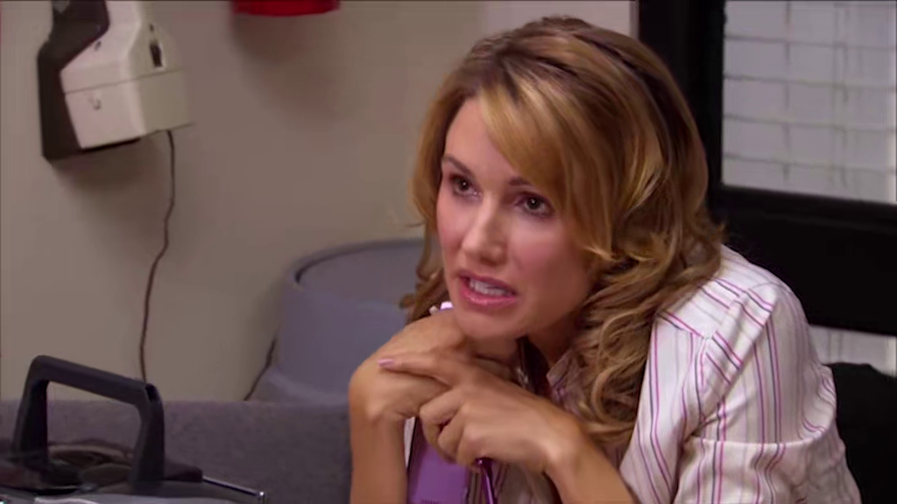

[S04E01-02 - Fun Run](https://theoffice.fandom.com/wiki/Fun_Run)

[S09E24-25 - Finale](https://theoffice.fandom.com/wiki/Finale)

## 10 - The One With Monica's Boots

Phoebe makes a parody of the song "Roxanne" by The Police.

> Ross can!

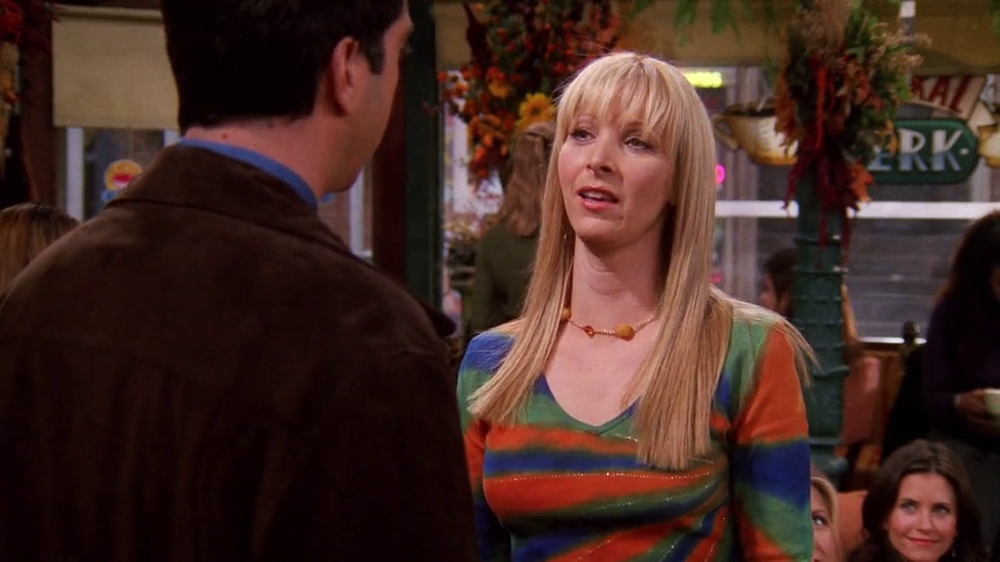

**The Office** [S03E16 - Phyllis' Wedding](https://theoffice.fandom.com/wiki/Phyllis'_Wedding)

Kevin band, [Scrantonicity](https://theoffice.fandom.com/wiki/Scrantonicity),
plays "Roxanne" at Phillys' wedding.

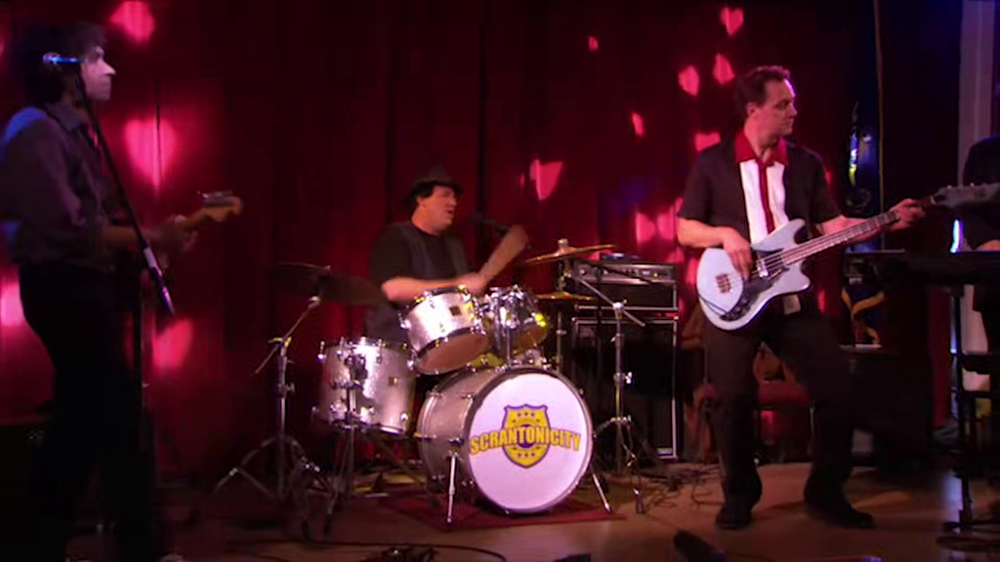

## 12 - The One Where Joey Dates Rachel

Joey and Rachel discuss about movies, and Rachel mentions Citizen Kane.

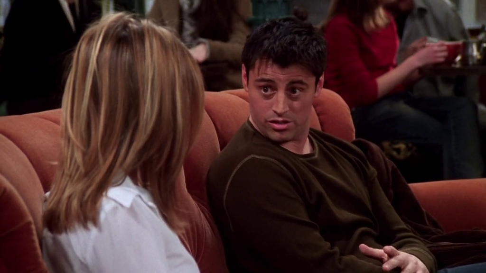

**The Office** [S07E01 - Nepotism](https://theoffice.fandom.com/wiki/Nepotism)

Michael's nephew Luke talks about his love for cinema and mentions Citizen Kane.

## 13 - The One Where Chandler Takes A Bath

Joey is thinking about his feelings for Rachel after their date, and tells himself
that he is fine, or as his friend "Tony" says:

> Great!

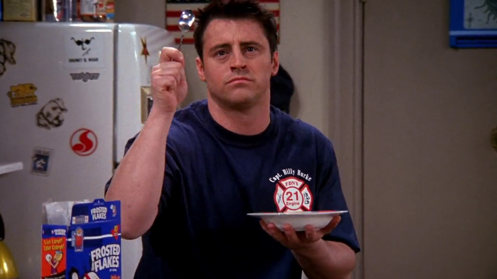

**The Office** [S02E13 - The Secret](https://theoffice.fandom.com/wiki/The_Secret)
and [S03E23 - The Job](https://theoffice.fandom.com/wiki/The_Job)

Michael does a parody of Tony The Tiger to Jim with his grape soda.

> It's gra...pe soda!

Michael says to David that he does not like the name Dunder Mifflin, and tries
to rename the company name to Paper Great, and says:

> We're Great!

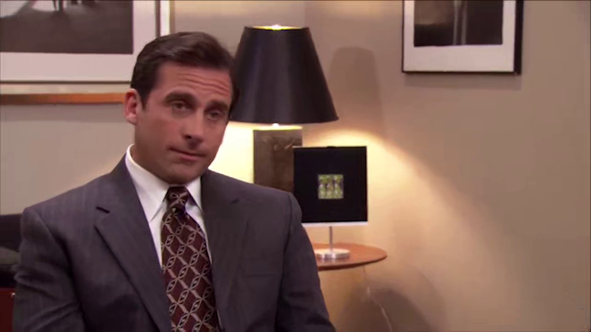

---

Ross and Rachel are suggesting names to their baby, and Rachel suggests the name **Rain**
for a girl.

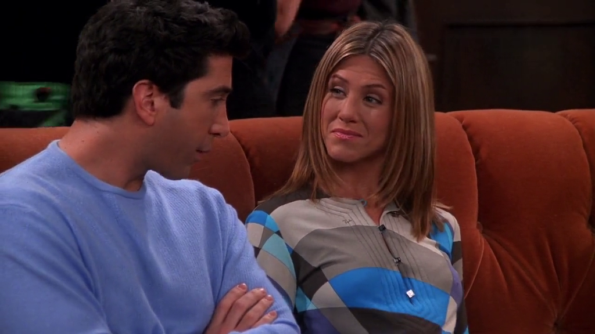

**The Office**

[Dwight](https://theoffice.fandom.com/wiki/Dwight_Schrute)
is played by [Rainn Wilson](https://theoffice.fandom.com/wiki/Rainn_Wilson).
His name has 2 "n" but it's close.

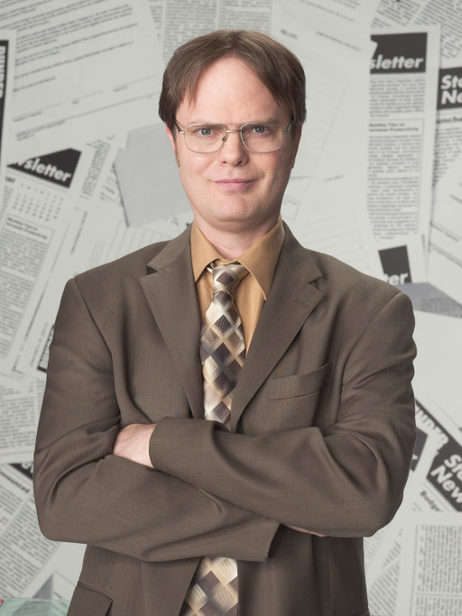

## 20 - The One With The Baby Shower

Joey is rehearsing for his new game show [Bamboozled](https://friends.fandom.com/wiki/Bamboozled)
with Chandler and Ross, and one of the questions is:

> Who invented bifocals?

And the answer is:

> Ben Franklin.

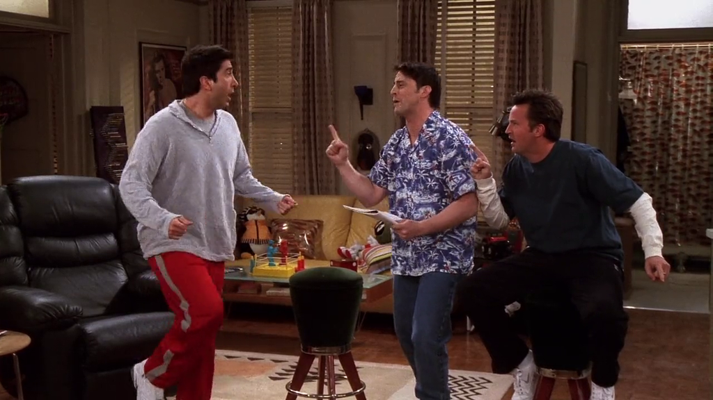

**The Office** [S03E14 - Ben Franklin](https://theoffice.fandom.com/wiki/Ben_Franklin)

A guy dress as Ben Franklin goes to Phillys' bachelorette party. Later, Dwight thinks
he is the real Ben Franklin. To be sure he asks questions such as:

> Are you near sighted or far sighted?

Which Ben Franklin replies:

> Both. That's why I invented the bifocal.

Dwight:

> GAH!!!

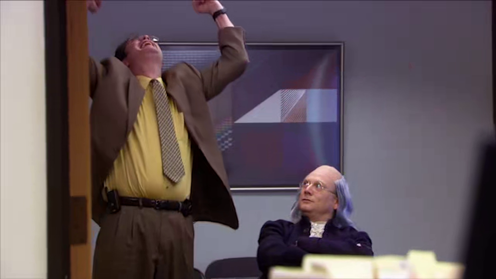
