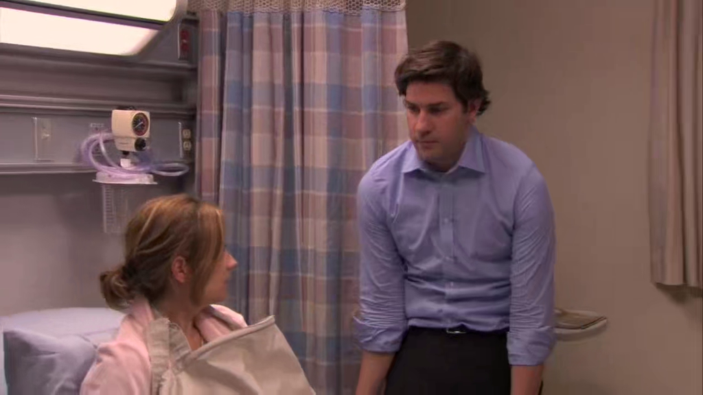
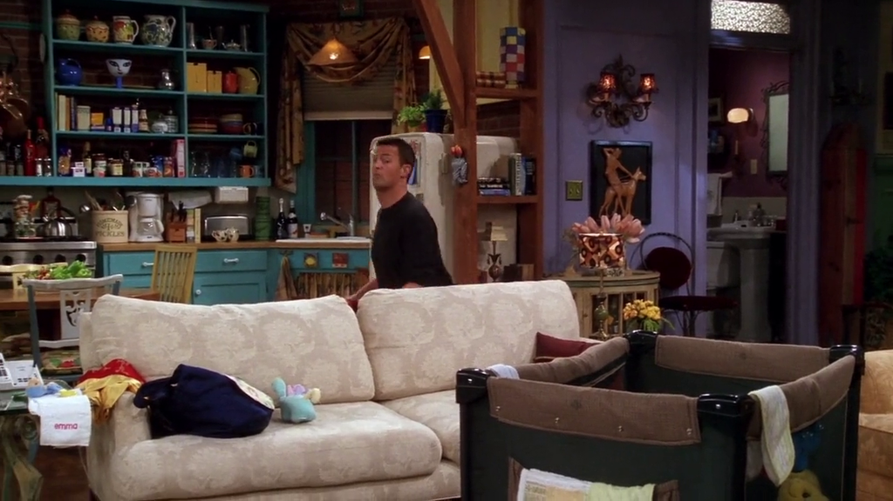
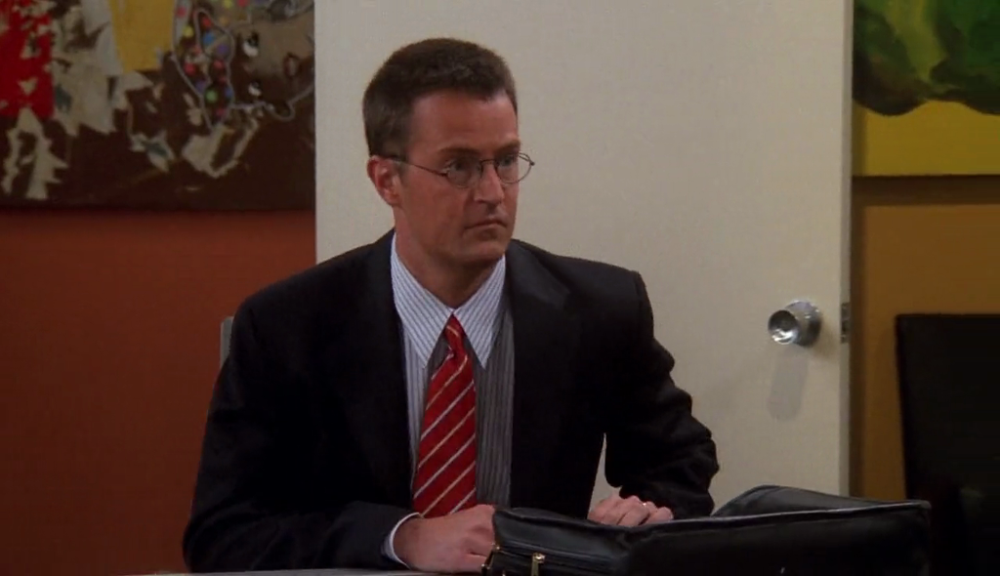
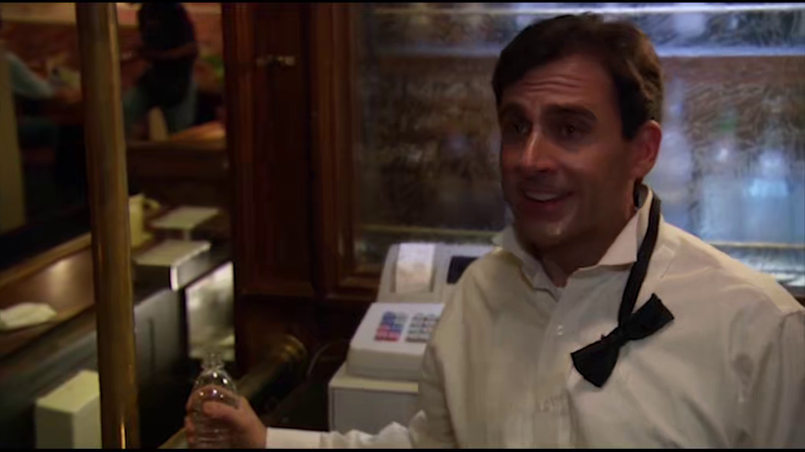
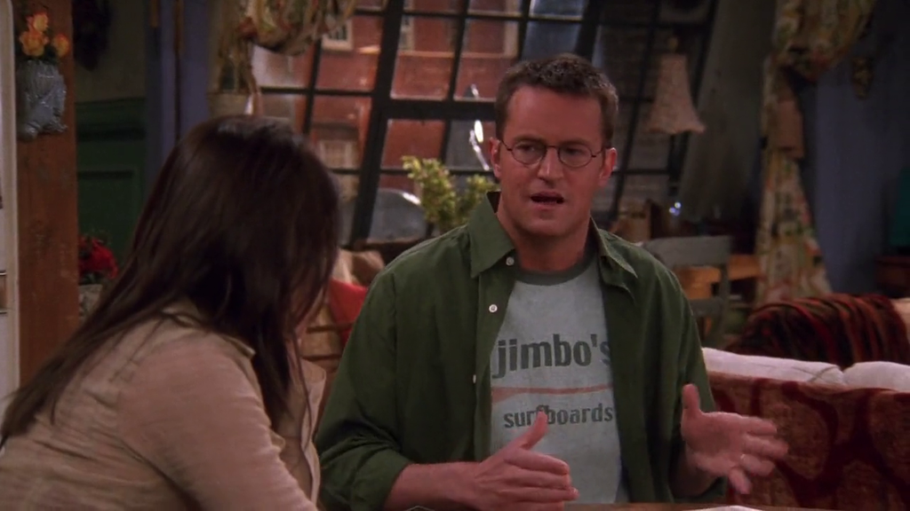

# Season 9

The ninth Season of Friends aired from September 26, 2002 to May 15, 2003.

## 01 - The One Where No One Proposes

Rachel has trouble with breast feeding.

> Yowsa!

**The Office** [S06E17-18 - The Delivery](https://theoffice.fandom.com/wiki/The_Delivery)

The same happens with Pam.

## 04 - The One With The Sharks

Ross lies to Mike about a super serious relationship that Phoebe had with Vikram.

**The Office** [S04E07-08 - Money](https://theoffice.fandom.com/wiki/Money)

Michael knows a guy name Vikram at his second job in Telemarketing.

## 06 - The One With The Male Nanny

Sandy, the male nanny, plays Green Sleeves on his recorder.

**The Office** [S02E18 - Take Your Daughter to Work Day](https://theoffice.fandom.com/wiki/Take_Your_Daughter_to_Work_Day)

Dwight plays Green Sleeves on his recorder to the kids in the conference room.

## 11 - The One Where Rachel Goes Back To Work

Gavin mentions Sandals Paradise Island\* to Rachel.

**The Office** [S03E10-11 - A Benihana Christmas](https://theoffice.fandom.com/wiki/A_Benihana_Christmas)

Michael invites Carol to Sandals Jamaica\* and ends up going with Jan.

> I've got two tickets to paradise!

\* **Not sure it's the same reference.**

## 14 - The One With The Blind Dates

Chandler plays with Emma and simulates going downstairs by crouching.

**The Office** [S03E04 - Grief Counseling](https://theoffice.fandom.com/wiki/Grief_Counseling)

Michael does the same at the office, simulating going downstairs to the warehouse.

## 15 - The One With The Mugging

Chandler mentions Bob Hope.

> I know I'm a little older than you guys, but it's not like I'm Bob Hope.

**The Office** [S02E01 - The Dundies](https://theoffice.fandom.com/wiki/The_Dundies)

Michael mentions Bob Hope. The reference is from the TV Special
[Bob Hope's Christmas Cheer from Saudi Arabia](https://www.imdb.com/title/tt0444724/).

## 16 - The One With The Boob Job

Chandler wears a t-shirt that says Jimbo's.

**The Office**

This was already stated [here](./season-1.md#_22-the-one-with-the-ick-factor).

## 20 - The One With The Soap Opera Party

Ross meets Charlie and he's supposed to also meet Prof. Spafford from Cornell.

**The Office** [S03E01 - Gay Witch Hunt](https://theoffice.fandom.com/wiki/Gay_Witch_Hunt)

Andy is graduated at the Cornell University.

## 23-24 - The One In Barbados

Jarvis is also from Cornell.

---

Monica and Mike play ping-pong at the hotel where Ross is giving a keynote speak.

**The Office** [S04E12 - The Deposition](https://theoffice.fandom.com/wiki/The_Deposition)

The warehouse gets a ping-pong table and Jim and Daryl struggles to see who's best.

When Jim starts to loose a lot to Daryl Pam sets a table at the conference room.

---

Mike is wearing a polo shirt with a "penguin".

**The Office** [S03E08 - The Merger](https://theoffice.fandom.com/wiki/The_Merger)

In a deleted scene, Andy is mocked by Kevin that call him the penguin
and he is wearing a shirt of the same brand.

> Michael, have you met the Penguin?

